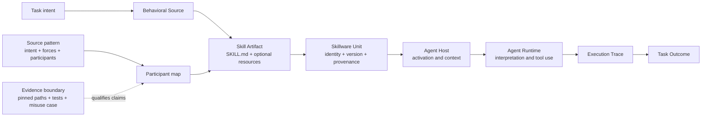

# Skillware Patterns

Executable, bilingual pattern-transfer records for the [Skillware paper](https://arxiv.org/abs/2607.18970).

[](https://github.com/MetaInFLow/skillware-patterns/actions/workflows/validate.yml)
[](https://github.com/MetaInFLow/skillware-patterns/releases/tag/v0.1-paper-v1)
[](https://arxiv.org/abs/2607.18970)
[](https://www.python.org/)
[](LICENSE-CODE)
[](LICENSE-DOCS)

[简体中文](README.zh-CN.md) · [Paper](https://arxiv.org/abs/2607.18970) · [Release `v0.1-paper-v1`](https://github.com/MetaInFLow/skillware-patterns/releases/tag/v0.1-paper-v1) · [Browse patterns](patterns/)

## What is Skillware?

**Skillware is the software abstraction that extends software engineering to persistent behavioral artifacts.** The paper argues that a Skill can be treated as software when its behavioral source is persistent, independently addressable, host-activated, and maintained through a software lifecycle.

This repository is the executable supplement for one bounded part of that argument: transferring established software design patterns to Skillware units and recording what the evidence does and does not support.



The Python samples execute deterministic oracles for declared contracts. They do not emulate a model, an Agent Host, or an Agent Runtime; those remain contextual execution concepts in the ontology.

Boundary shorthand: `Behavioral Source -> Skill Artifact -> Skillware Unit -> Agent Host -> Agent Runtime`.

### What this is

- A self-contained research artifact tied to [arXiv:2607.18970](https://arxiv.org/abs/2607.18970).
- A sourced screen of all 23 Gang of Four patterns, with 10 detailed GoF implementations.
- Twelve standalone records: six main-text GoF mappings, four supplementary GoF mappings, and two established non-GoF traditions.
- Bilingual definitions, participant maps, public fixed-revision correspondence records, runnable Skill examples, close misuse cases, and focused tests.

### What this is not

- Not a new design-pattern taxonomy and not a claim to invent GoF, POSA, or DDD patterns.
- Not a marketplace, Skill registry, Agent Host, Agent Runtime, model benchmark, or production reliability study.
- Not evidence that a local deterministic sample reproduces upstream model behavior or proves cross-Host equivalence.
- Not a maturity ladder: pattern, implementation dimension, mechanism, and lifecycle stage remain separate analytical axes.

## What you get

| Surface | Contents | Start here |
| --- | --- | --- |
| Definitions | English and Chinese source-pattern definitions plus Skillware participant maps | [`patterns/<pattern>/definition.md`](patterns/facade/definition.md) |
| Ecosystem evidence | Public upstream links frozen to immutable commits and a controlled claim status | [`correspondence.md`](patterns/facade/correspondence.md) |
| Complete Skills | Root `SKILL.md`, child Skills or target bindings, references, scripts, fixtures, and expected results | [Facade sample](patterns/facade/sample/) |
| Verification | Focused tests, misuse discriminators, catalog checks, documentation checks, and repository validator | [`tests/`](tests/) · [`scripts/validate_repository.py`](scripts/validate_repository.py) |
| Paper binding | Claim-level mapping from paper Table 5 to local records and release | [`docs/paper-map.md`](docs/paper-map.md) |

## Scope at a glance

| Scope | Count | Interpretation |
| --- | ---: | --- |
| 23 GoF patterns screened | **23** | One sourced screening record for every canonical Gang of Four pattern; screening is not implementation. |
| 10 detailed GoF implementations | **10** | Facade, Adapter, Composite, Observer, State, Strategy, Decorator, Template Method, Memento, and Mediator. |
| 2 patterns from other established traditions | **2** | POSA Pipes and Filters and DDD Specification; they are labeled separately from GoF. |
| Language | Python **3.10+** | Samples use the standard library; PyYAML is used by catalog tooling and the validator. |
| Release binding | `v0.1-paper-v1` | The public repository release bound to the paper revision described in [`docs/paper-map.md`](docs/paper-map.md). |

## Quick start: a 60-second deterministic demo

```bash
git clone https://github.com/MetaInFLow/skillware-patterns.git
cd skillware-patterns
python3 patterns/facade/sample/scripts/run_demo.py
```

The Production Incident Response Facade accepts one stable request and coordinates three specialist Skills. The output is deterministic and should match [`incident-result.json`](patterns/facade/sample/expected/incident-result.json):

```json
{
  "summary": "checkout-api is experiencing elevated 5xx responses.",
  "impact": "Customer requests may fail; treat checkout availability as degraded.",
  "actions": [
    "page-on-call",
    "inspect-recent-deployments",
    "check-upstream-dependencies"
  ],
  "communication": "Investigating elevated 5xx responses for checkout-api; customer impact is being assessed."
}
```

Read the complete [root Skill](patterns/facade/sample/SKILL.md), [participant map](patterns/facade/participant-map.yaml), [misuse case](patterns/facade/misuse/SKILL.md), and [focused tests](patterns/facade/sample/tests/test_demo.py) to see how the mapping is made concrete. Every other pattern directory has the same inspectable record shape, with Adapter documenting three target bindings instead of separate child Skills.

## Support status

This release separates what is implemented locally from what is observed in public upstream artifacts.

| Surface | Status | Meaning |
| --- | --- | --- |
| Twelve local samples | **constructive** | The repository demonstrates that the declared Skillware mapping can be built and tested deterministically. |
| Facade ecosystem case | **confirmed correspondence** | The pinned Superpowers source paths satisfy the recorded participant relation. |
| Adapter ecosystem case | **confirmed correspondence** | The pinned gstack source paths show explicit host-target bindings; runtime parity still needs tests. |
| Composite, Observer, State, Strategy, Decorator, Template Method, Memento, Mediator, Pipes and Filters | **candidate correspondence** | Some source-level participants or behaviors remain unverified at the frozen paths. |
| Specification ecosystem case | **not observable** | No public artifact was admitted as a bounded Specification correspondence in this release. |
| Model interpretation and cross-Host behavior | **out of scope** | Python oracle output cannot establish these claims. |

Statuses are descriptive claim labels, not scores. See the full [status vocabulary](docs/evidence-and-claim-status.md) and [limitations](docs/limitations.md).

## Pattern catalog

The twelve records are peers in one flat navigation tree. `source_tradition`, `source_category`, `paper_role`, and `implementation_status` live in each [`pattern.yaml`](catalog/pattern-index.yaml); the source category is metadata, not a second taxonomy.

| Pattern | 中文名 | Tradition / category | Scenario | Ecosystem status | Upstream example | Local sample |
| --- | --- | --- | --- | --- | --- | --- |
| [Facade](patterns/facade/definition.md) | 外观模式 | GoF / structural | Production Incident Response | confirmed correspondence | [Superpowers `using-superpowers`](patterns/facade/correspondence.md) | [sample](patterns/facade/sample/) |
| [Adapter](patterns/adapter/definition.md) | 适配器模式 | GoF / structural | Multi-Tracker Issue Publisher | confirmed correspondence | [gstack host bindings](patterns/adapter/correspondence.md) | [sample](patterns/adapter/sample/) |
| [Composite](patterns/composite/definition.md) | 组合模式 | GoF / structural | Investment Memo Builder | candidate correspondence | [OpenMontage pipeline](patterns/composite/correspondence.md) | [sample](patterns/composite/sample/) |
| [Observer](patterns/observer/definition.md) | 观察者模式 | GoF / behavioral | Software Release Notification | candidate correspondence | [ECC lifecycle hooks](patterns/observer/correspondence.md) | [sample](patterns/observer/sample/) |
| [State](patterns/state/definition.md) | 状态模式 | GoF / behavioral | Vendor Onboarding Workflow | candidate correspondence | [OpenMontage checkpoints](patterns/state/correspondence.md) | [sample](patterns/state/sample/) |
| [Strategy](patterns/strategy/definition.md) | 策略模式 | GoF / behavioral | Risk-Aware Code Review | candidate correspondence | [UI/UX Pro Max routing](patterns/strategy/correspondence.md) | [sample](patterns/strategy/sample/) |
| [Decorator](patterns/decorator/definition.md) | 装饰模式 | GoF / structural | Contract Review Enhancers | candidate correspondence | [Caveman activation hook](patterns/decorator/correspondence.md) | [sample](patterns/decorator/sample/) |
| [Template Method](patterns/template-method/definition.md) | 模板方法模式 | GoF / behavioral | Enterprise RFP Response | candidate correspondence | [Superpowers workflow Skills](patterns/template-method/correspondence.md) | [sample](patterns/template-method/sample/) |
| [Memento](patterns/memento/definition.md) | 备忘录模式 | GoF / behavioral | Configuration Migration | candidate correspondence | [Microsoft SkillOpt staging](patterns/memento/correspondence.md) | [sample](patterns/memento/sample/) |
| [Mediator](patterns/mediator/definition.md) | 中介者模式 | GoF / behavioral | Deployment Coordinator | candidate correspondence | [Anthropic financial-services reconciler](patterns/mediator/correspondence.md) | [sample](patterns/mediator/sample/) |
| [Pipes and Filters](patterns/pipes-and-filters/definition.md) | 管道-过滤器模式 | POSA / architectural | Support Ticket Triage | candidate correspondence | [OpenMontage animated-explainer pipeline](patterns/pipes-and-filters/correspondence.md) | [sample](patterns/pipes-and-filters/sample/) |
| [Specification](patterns/specification/definition.md) | 规约模式 | DDD / domain | Expense Approval Policy | not observable | No admitted upstream case | [sample](patterns/specification/sample/) |

The [GoF-23 screening matrix](catalog/gof-23-screening.md) records the other thirteen GoF patterns as screening records only. The [detailed index](catalog/pattern-index.md) is the machine-rendered catalog source.

## Upstream examples and evidence

Each link below names the concrete public Skill, hook, pipeline, binding, or staging path inspected for the corresponding record. Star counts are discovery snapshots checked **2026-07-23**; they help readers find important ecosystem examples but are not evidence strength, quality ratings, or paper results. Every evidence record pins an immutable revision.

| Pattern | Public project | Snapshot | Exact inspected use |
| --- | --- | ---: | --- |
| Facade | [obra/superpowers](https://github.com/obra/superpowers) | ~259k stars | [`skills/using-superpowers/SKILL.md`](https://github.com/obra/superpowers/blob/896224c4b1879920ab573417e68fd51d2ccc9072/skills/using-superpowers/SKILL.md) selects and invokes specialist Skills; [`hooks/session-start`](https://github.com/obra/superpowers/blob/896224c4b1879920ab573417e68fd51d2ccc9072/hooks/session-start) bootstraps discovery. |
| Adapter | [garrytan/gstack](https://github.com/garrytan/gstack) | ~124k stars | [`SKILL.md.tmpl`](https://github.com/garrytan/gstack/blob/11de390be1be6849eb9a15f91ff4922dd16c589a/SKILL.md.tmpl), [`scripts/gen-skill-docs.ts`](https://github.com/garrytan/gstack/blob/11de390be1be6849eb9a15f91ff4922dd16c589a/scripts/gen-skill-docs.ts), and [`hosts/codex.ts`](https://github.com/garrytan/gstack/blob/11de390be1be6849eb9a15f91ff4922dd16c589a/hosts/codex.ts) bind one Skill contract to a host target. |
| Composite | [calesthio/OpenMontage](https://github.com/calesthio/OpenMontage) | ~41.2k stars | [`pipeline_defs/animation.yaml`](https://github.com/calesthio/OpenMontage/blob/db91727598d08d40919d7d68a47864a5467bd448/pipeline_defs/animation.yaml) and its stage Skills are loaded by [`lib/pipeline_loader.py`](https://github.com/calesthio/OpenMontage/blob/db91727598d08d40919d7d68a47864a5467bd448/lib/pipeline_loader.py). This remains a candidate because the reviewed tree does not establish a complete one-parent composite contract. |
| Observer | [affaan-m/Everything Claude Code](https://github.com/affaan-m/ECC) | ~232k stars | [`hooks/hooks.json`](https://github.com/affaan-m/ECC/blob/2bc924faf2f8e893bfe0af86b1931283693c30ae/hooks/hooks.json) routes lifecycle events to [`run-with-flags.js`](https://github.com/affaan-m/ECC/blob/2bc924faf2f8e893bfe0af86b1931283693c30ae/scripts/hooks/run-with-flags.js) and [`continuous-learning-v2/hooks/observe.sh`](https://github.com/affaan-m/ECC/blob/2bc924faf2f8e893bfe0af86b1931283693c30ae/skills/continuous-learning-v2/hooks/observe.sh). |
| State | [calesthio/OpenMontage](https://github.com/calesthio/OpenMontage) | ~41.2k stars | [`lib/checkpoint.py`](https://github.com/calesthio/OpenMontage/blob/db91727598d08d40919d7d68a47864a5467bd448/lib/checkpoint.py) and [`skills/meta/checkpoint-protocol.md`](https://github.com/calesthio/OpenMontage/blob/db91727598d08d40919d7d68a47864a5467bd448/skills/meta/checkpoint-protocol.md) persist stage/status branches. Full GoF delegation is not established. |
| Strategy | [nextlevelbuilder/ui-ux-pro-max-skill](https://github.com/nextlevelbuilder/ui-ux-pro-max-skill) | ~109k stars | [`SKILL.md`](https://github.com/nextlevelbuilder/ui-ux-pro-max-skill/blob/8a81ed60272d21d4b8808f7308d49a0b1b000555/.claude/skills/ui-ux-pro-max/SKILL.md) routes through [`scripts/search.py`](https://github.com/nextlevelbuilder/ui-ux-pro-max-skill/blob/8a81ed60272d21d4b8808f7308d49a0b1b000555/.claude/skills/ui-ux-pro-max/scripts/search.py); alternatives lack a single declared substitution contract. |
| Decorator | [JuliusBrussee/caveman](https://github.com/JuliusBrussee/caveman) | ~92.1k stars | [`src/hooks/caveman-activate.js`](https://github.com/JuliusBrussee/caveman/blob/25d22f864ad68cc447a4cb93aefde918aa4aec9f/src/hooks/caveman-activate.js) wraps activation with the [`skills/caveman/SKILL.md`](https://github.com/JuliusBrussee/caveman/blob/25d22f864ad68cc447a4cb93aefde918aa4aec9f/skills/caveman/SKILL.md) guidance; a complete GoF Component contract is not declared. |
| Template Method | [obra/superpowers](https://github.com/obra/superpowers) | ~259k stars | [`skills/brainstorming/SKILL.md`](https://github.com/obra/superpowers/blob/896224c4b1879920ab573417e68fd51d2ccc9072/skills/brainstorming/SKILL.md) and [`skills/test-driven-development/SKILL.md`](https://github.com/obra/superpowers/blob/896224c4b1879920ab573417e68fd51d2ccc9072/skills/test-driven-development/SKILL.md) share ordered process guidance; bounded specialization hooks remain unverified. |
| Memento | [microsoft/SkillOpt](https://github.com/microsoft/SkillOpt) | ~14.5k stars | [`skillopt_sleep/staging.py`](https://github.com/microsoft/SkillOpt/blob/b860a5cf88ce75e2bd02ca981ac21fb28cffba83/skillopt_sleep/staging.py) backs up a staging manifest before adoption; the inspected path does not expose a complete owned restore protocol. |
| Mediator | [anthropics/financial-services](https://github.com/anthropics/financial-services) | ~33.7k stars | [`managed-agent-cookbooks/gl-reconciler/agent.yaml`](https://github.com/anthropics/financial-services/blob/4aa51ed3d379731f8f9beff498d749580372699c/managed-agent-cookbooks/gl-reconciler/agent.yaml) coordinates reader, critic, and resolver subagents; the release coordinator is a candidate mapping. |
| Pipes and Filters | [calesthio/OpenMontage](https://github.com/calesthio/OpenMontage) | ~41.2k stars | [`pipeline_defs/animated-explainer.yaml`](https://github.com/calesthio/OpenMontage/blob/db91727598d08d40919d7d68a47864a5467bd448/pipeline_defs/animated-explainer.yaml) orders stage Skills loaded by [`lib/pipeline_loader.py`](https://github.com/calesthio/OpenMontage/blob/db91727598d08d40919d7d68a47864a5467bd448/lib/pipeline_loader.py). |
| Specification | — | — | No public upstream artifact was admitted as a bounded Specification correspondence; see the [negative evidence record](patterns/specification/correspondence.md). |

The local evidence files explain what each path proves, what it does not prove, and why the controlled status is not stronger. They are not vendor endorsements and do not copy upstream code.

## How to read a pattern record

Every detailed pattern is a compact, inspectable Skillware record:

```text
pattern.yaml             source name, Chinese name, tradition, role, scenario
definition.md            source intent, forces, participants, consequences
definition.zh-CN.md      Chinese definition with the same claim boundary
participant-map.yaml     source participant -> Skillware participant relation
correspondence.md        public revision, exact paths, status, caveats
evidence/                 frozen upstream evidence when a public case is admitted
sample/SKILL.md           complete root Skill and its public request/result contract
sample/child-skills/      specialist Skills, when the scenario uses them
sample/references/        schemas, policies, and reusable reference material
sample/scripts/           deterministic oracle and demo entry point
sample/fixtures/          positive and negative inputs
sample/expected/           versioned expected outputs and errors
sample/tests/              focused verification of behavior and boundaries
misuse/                    close non-example and decisive discriminator
```

The [Facade record](patterns/facade/) is the shortest route through all seven parts. The [Adapter record](patterns/adapter/) shows how one canonical Skill request can be rendered into GitHub REST, Jira REST/ADF, and Linear GraphQL target contracts.

## Admission protocol

A pattern-transfer claim is admitted only when one declared Skillware Unit and revision records all seven elements in the [transfer protocol](docs/pattern-transfer-protocol.md):

```text
Source intent
Design forces
Participant correspondence
Consequences
Implementation evidence
Focused verification
Misuse discriminator
```

Names, filenames, comments, or visual resemblance do not establish a transfer. A local sample can be `constructive` even when public ecosystem correspondence remains `candidate correspondence` or `not observable`.

## Reproducibility

Python 3.10+ is required. A clean checkout can run the sample without network access or credentials; install PyYAML before catalog-dependent checks:

```bash
python3 -m venv .venv
source .venv/bin/activate
python -m pip install -e .

# One sample, then focused and full verification
python3 patterns/facade/sample/scripts/run_demo.py
python3 -m unittest discover -s patterns/facade/sample/tests -v
python3 -m unittest tests/test_docs.py -v
python3 -m unittest discover -s tests -v
python3 scripts/validate_repository.py
```

Every sample is designed to run from the repository root or its own sample directory and uses Python's standard library for its executable oracle. The [validation workflow](https://github.com/MetaInFLow/skillware-patterns/actions/workflows/validate.yml) repeats the repository checks on pushes and pull requests; a workflow badge is a live status indicator, not a paper result.

## Repository map

```text
catalog/                 GoF-23 screen and detailed machine/human indexes
docs/                    ontology, paper map, protocol, statuses, limitations
patterns/<pattern>/      one flat, independently inspectable pattern record
  definition*.md         English and Chinese source definitions
  participant-map.yaml   source-to-Skillware participant correspondence
  correspondence.md      public evidence and bounded claim status
  evidence/              pinned upstream case files, where available
  sample/                complete Skill, resources, oracle, fixtures, tests
  misuse/                close non-example and discriminator
scripts/                 deterministic catalog/repository validator
tests/                   documentation, shape, catalog, record, and sample tests
```

## Paper and repository role

The public paper [*Skillware: A Software Ontology and Engineering Lifecycle for Persistent Behavioral Artifacts*](https://arxiv.org/abs/2607.18970) defines the ontology and motivates software-engineering continuity. This repository publishes the transfer protocol, sourced catalog, participant maps, public frozen cases, constructive samples, misuse cases, and focused verification for release [`v0.1-paper-v1`](https://github.com/MetaInFLow/skillware-patterns/releases/tag/v0.1-paper-v1).

The private authoring/research archive preserves manuscript source, corpus analysis, frozen cases, counterevidence, and provenance at authoring revision `1fc1dfd`; that identifier is retained for traceability but the archive is not a public dependency. This repository cannot validate the ontology or establish ecosystem prevalence by itself.

## Research boundary and claim statuses

| Status | Meaning |
| --- | --- |
| `constructive` | The local sample demonstrates that the declared mapping can be built and tested. |
| `confirmed correspondence` | Fixed-revision public source evidence satisfies the participant relation. |
| `candidate correspondence` | Partial source evidence exists, but a participant or behavior remains unverified. |
| `unsupported` | Available evidence contradicts or fails the source pattern contract. |
| `not observable` | The required relation cannot be evaluated from available artifacts. |

These statuses are descriptive, not a score. They do not rank patterns, projects, usefulness, quality, or maturity.

The artifacts demonstrate bounded constructibility and, where stated, fixed-revision correspondence. They do not establish ecosystem frequency, automatic quality advantage, production reliability, security, comparative performance, model interpretation, or cross-Host behavioral equivalence. Deterministic oracles verify declared sample contracts; they do not reproduce an Agent Runtime or prove that natural-language interpretation is invariant.

See the complete [evidence vocabulary](docs/evidence-and-claim-status.md) and [limitations](docs/limitations.md).

## Citation

Haodi Fan and Zucong Lan. [*Skillware: A Software Ontology and Engineering Lifecycle for Persistent Behavioral Artifacts*](https://arxiv.org/abs/2607.18970). arXiv:2607.18970 [cs.SE], submitted 21 July 2026.

For software citation metadata, use [`CITATION.cff`](CITATION.cff). For claim-level paper paths, use [`docs/paper-map.md`](docs/paper-map.md). The release that binds this supplement to the public paper is [`v0.1-paper-v1`](https://github.com/MetaInFLow/skillware-patterns/releases/tag/v0.1-paper-v1).

## Contributing

Start with [`CONTRIBUTING.md`](CONTRIBUTING.md). New records must preserve an established source tradition, exact participant map, bilingual definitions, a complete standalone Skill sample, a close misuse case, focused tests, the seven-element admission protocol, and a controlled claim status. Contributions should distinguish public upstream evidence from local constructive evidence and must not treat a pattern name as proof.

## Security

This repository runs local deterministic examples and does not require secrets, network access, or third-party service credentials. Do not place credentials in fixtures or correspondence records. Report a security issue through the [private GitHub security reporting page](https://github.com/MetaInFLow/skillware-patterns/security) rather than opening a public issue.

## Community and project links

- [Open issues](https://github.com/MetaInFLow/skillware-patterns/issues) for reproducible defects or documentation corrections.
- [Pull requests](https://github.com/MetaInFLow/skillware-patterns/pulls) for reviewed changes.
- [Code of Conduct](CODE_OF_CONDUCT.md) for participation norms.
- [Paper](https://arxiv.org/abs/2607.18970) for the ontology and research claims.

## License

The operative file boundary is exhaustive and disjoint:

```text
Apache-2.0
  .github/**
  .gitignore
  pyproject.toml
  scripts/**
  tests/**
  patterns/*/sample/**

CC-BY-4.0
  README.md
  README.zh-CN.md
  CITATION.cff
  CONTRIBUTING.md
  CODE_OF_CONDUCT.md
  catalog/**
  docs/**
  patterns/.gitkeep
  patterns/*/** excluding patterns/*/sample/**

Canonical upstream texts (outside repository relicensing)
  LICENSE-CODE
  LICENSE-DOCS
```

The Apache-2.0 class is licensed under the [Apache License 2.0](LICENSE-CODE); the CC-BY-4.0 class is licensed under [Creative Commons Attribution 4.0 International](LICENSE-DOCS). `LICENSE-CODE` and `LICENSE-DOCS` retain their canonical upstream texts and are outside repository relicensing. Linked third-party artifacts remain under their upstream licenses. See [`CONTRIBUTING.md#license-boundary`](CONTRIBUTING.md#license-boundary) for contribution terms.
