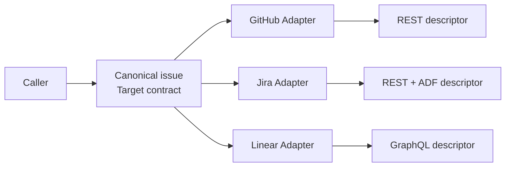

# 适配器模式 / Adapter

> **Scenario / 场景:** Multi-Tracker Issue Publisher / 多问题追踪器发布

## 1. 先看问题 / The problem

A task caller has one issue to publish, while GitHub, Jira, and Linear expect
different request shapes. Duplicating the publishing Skill for each tracker
causes the canonical issue meaning to drift:

```text
one issue rule -> GitHub-specific Skill
               -> Jira-specific Skill
               -> Linear-specific Skill
```

## 2. 模式一句话 / Pattern in one sentence

**Keep one canonical Skill contract and translate it at the boundary required by
each target system.**



The canonical issue stays stable; only the target representation changes.

## 3. 现实中的 Skill / Existing Skill case

**Case Skill:** [gstack `SKILL.md.tmpl`](https://github.com/garrytan/gstack/blob/11de390be1be6849eb9a15f91ff4922dd16c589a/SKILL.md.tmpl), its [generator](https://github.com/garrytan/gstack/blob/11de390be1be6849eb9a15f91ff4922dd16c589a/scripts/gen-skill-docs.ts), and [Host bindings](https://github.com/garrytan/gstack/tree/11de390be1be6849eb9a15f91ff4922dd16c589a/hosts). **Status: confirmed correspondence.**

What the case does: one Skill template is rendered into Host-specific surfaces
such as Claude and Codex bindings.

```text
canonical Skill template
  -> Claude binding
  -> Codex binding
```

The pattern signal is translation at the Host boundary, with the canonical
behavioral contract kept in one place.

## 4. 本仓库的 Mock Skill / Mock Skill

Our concrete example is `multi-tracker-issue-publisher`:

```text
patterns/adapter/sample/
├── SKILL.md                              # canonical issue contract
├── references/tracker-contracts.md       # target request contracts
├── child-skills/
│   ├── github/SKILL.md                   # Adapter 1
│   ├── jira/SKILL.md                     # Adapter 2
│   └── linear/SKILL.md                   # Adapter 3
├── scripts/run_demo.py
└── tests/test_demo.py
```

The important part of [`sample/SKILL.md`](sample/SKILL.md) is:

```markdown
<!-- Adapter: preserve issue identity and severity; change target syntax. -->
Target is one of `github`, `jira`, or `linear`.
1. validate the canonical issue
2. select the target binding
3. build the target request descriptor
4. return the descriptor without making a network call
```

Input contains one canonical issue with `id`, `title`, `body`, and `severity`.
The output is a versioned offline descriptor for the selected tracker.

## 5. 角色对应 / Role mapping

| GoF role | Skillware carrier in this example |
| --- | --- |
| Client | task caller |
| Target | canonical issue-publisher contract |
| Adapter | `github`, `jira`, or `linear` binding Skill |
| Adaptee | target tracker REST or GraphQL request contract |

## 6. 什么时候使用 / When to use

| Use Adapter when | Keep it simple when |
| --- | --- |
| one behavioral contract meets incompatible Host or vendor interfaces | the target already accepts the canonical contract |
| target-specific translation should stay at the boundary | translation would change the intended meaning |
| new targets should not fork the root Skill | there is only one stable target |

## 7. 运行与验证 / Run and inspect

```bash
python3 sample/scripts/run_demo.py
python3 -m unittest discover -s sample/tests -v
```

Read the [complete sample](sample/), [participant map](participant-map.yaml),
[definition](definition.md), and [misuse case](misuse/explanation.md).

## 8. 证据边界 / Evidence boundary

The local oracle verifies descriptor translation and semantic preservation. The
gstack correspondence records source-level bindings; runtime parity with each
Host and tracker remains outside this sample.
