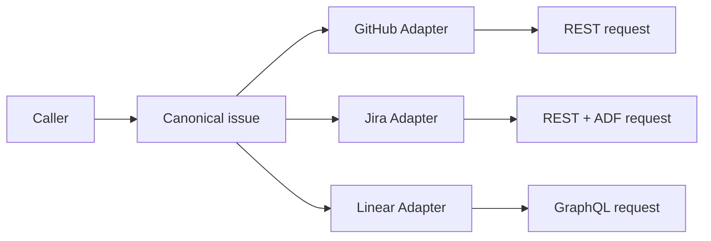

# 适配器模式（Adapter）

## 一眼看懂 / At a glance

**一句话：** 同一个规范 Skill 不变，只把它翻译成不同 Host 或供应商需要的请求格式。

| | Case Skill（上游案例） | Mock sample（本仓库构造） |
| --- | --- | --- |
| **是哪一个** | [gstack Skill template](https://github.com/garrytan/gstack/blob/11de390be1be6849eb9a15f91ff4922dd16c589a/SKILL.md.tmpl) + [Host bindings](https://github.com/garrytan/gstack/tree/11de390be1be6849eb9a15f91ff4922dd16c589a/hosts) | [`multi-tracker-issue-publisher`](sample/SKILL.md) |
| **哪里体现模式** | 一个规范 Skill 被翻译成 Claude/Codex 等 Host 的不同入口 | 一个 canonical issue 被翻译成 GitHub/Jira/Linear 三种请求 |
| **怎么运行** | 由 gstack setup 生成 Host Skill | `python3 sample/scripts/run_demo.py` |

**看哪三个文件：** `sample/SKILL.md`、`sample/scripts/run_demo.py`、`sample/references/tracker-contracts.md`。

This record transfers the Gang of Four Adapter pattern to Skillware. It maps
the canonical issue-publishing Skill to the Adaptee, each tracker contract to a
Target, each thin tracker binding to an Adapter, and the task caller to the
Client.

The standalone sample is **Multi-Tracker Issue Publisher / 多问题追踪器发布**.
Its root Skill accepts one canonical issue plus exact target context, then
builds an offline, versioned GitHub REST, Jira REST v3, or Linear GraphQL
request descriptor without changing identity or severity meaning.

- [English definition](definition.md)
- [中文定义](definition.zh-CN.md)
- [Participant map](participant-map.yaml)
- [Open-source correspondence](correspondence.md)
- [Runnable sample](sample/)
- [Misuse discriminator](misuse/explanation.md)

## Case Skill: upstream implementation

**Case Skill:** the generated gstack Skill surface from `SKILL.md.tmpl`.

The high-star comparison is [garrytan/gstack](https://github.com/garrytan/gstack):
`SKILL.md.tmpl` is translated by `scripts/gen-skill-docs.ts` into Host-specific
surfaces such as `hosts/claude.ts` and `hosts/codex.ts`, with a Codex invocation
test in `test/codex-e2e.test.ts`. The pinned paths and correspondence boundary
are in the [upstream evidence record](../../docs/upstream-skill-evidence.md#adapter--适配器模式).
The local demo contains complete GitHub, Jira, and Linear child bindings under
[`sample/child-skills/`](sample/child-skills/).

## Mock sample Skill: this repository

**Mock Skill:** [`sample/SKILL.md`](sample/SKILL.md), named
`multi-tracker-issue-publisher`. It accepts one canonical issue and emits an
offline descriptor for GitHub, Jira, or Linear.

The Adapter idea is implemented by preserving canonical issue semantics while
`adapt_github`, `adapt_jira`, and `adapt_linear` translate the contract into
target-specific request shapes. Run `python3 sample/scripts/run_demo.py`; the
role mapping is in [`participant-map.yaml`](participant-map.yaml).

The constructive sample and the gstack ecosystem correspondence are separate
evidence claims. Neither establishes ecosystem frequency, cross-Host runtime
parity, or an automatic improvement in quality.
