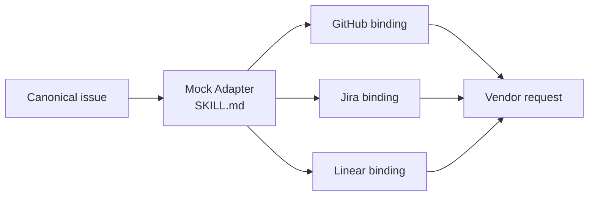

# Multi-Tracker Issue Publisher

> **This directory is the mock sample.** It demonstrates the Adapter idea
> offline; it is not the upstream gstack implementation.

## Evidence at a glance



| Evidence layer | Open this | What proves the Adapter relation |
| --- | --- | --- |
| **Upstream case Skill** | [gstack `SKILL.md.tmpl`](https://github.com/garrytan/gstack/blob/11de390be1be6849eb9a15f91ff4922dd16c589a/SKILL.md.tmpl) + [Host bindings](https://github.com/garrytan/gstack/tree/11de390be1be6849eb9a15f91ff4922dd16c589a/hosts) | One canonical Skill surface is translated for different Host contracts. |
| **Mock Adapter** | [`SKILL.md#target-bindings`](SKILL.md#target-bindings) | Canonical issue identity and severity stay unchanged while target shape changes. |
| **Target contracts** | [`references/tracker-contracts.md`](references/tracker-contracts.md) | GitHub REST, Jira REST/ADF, and Linear GraphQL are explicit targets. |
| **Executable proof** | [`scripts/run_demo.py`](scripts/run_demo.py) · [`tests/test_demo.py`](tests/test_demo.py) | Three bindings produce offline descriptors without network calls. |

**The pattern-bearing line is:** one canonical issue → one selected binding →
one target-specific request. That translation is the Adapter evidence.

## Mock Skill source

```text
sample/
├── SKILL.md
├── references/tracker-contracts.md
├── scripts/run_demo.py
├── fixtures/valid/{github,jira,linear}.json
└── tests/test_demo.py
```

```markdown
<!-- Adapter: translate the representation, preserve issue meaning. -->
## Target bindings
GitHub -> POST /repos/{owner}/{repo}/issues
Jira   -> POST /rest/api/3/issue
Linear -> issueCreate GraphQL mutation

Identity and severity stay in every offline descriptor; no network call occurs.
```

## Learn the pattern

| Before: copy the issue workflow per target | After: one canonical Skill plus thin bindings |
| --- | --- |
| `publish-to-github(issue)`<br>`publish-to-jira(issue)`<br>`publish-to-linear(issue)`<br><br>Validation and severity rules are duplicated, so business meaning can drift. | `canonical issue -> selected Adapter -> target request descriptor`<br><br>One canonical Skill owns meaning; bindings own target syntax. |

### Use it when

| Use Adapter when | Keep it simple when |
| --- | --- |
| one intent must reach incompatible Host/vendor contracts | targets already share one contract |
| target differences are representational | target differences change business meaning |
| semantic identity must survive translation | each target needs a separate domain workflow |

### Skill-author recipe

1. Write canonical input/output meaning first.
2. Treat each target format as an explicit binding.
3. Preserve identity, units, severity, and error meaning.
4. Test every binding with the same canonical fixtures.

## Scenario

A triage Skill has one canonical issue (`id`, `title`, `description`, and
`severity`) but the team may file it in GitHub, Jira, or Linear. The demo
builds the target request without credentials or network access.

## Why this is Adapter

The canonical issue is the Adaptee. Each target binding translates that same
meaning into a different vendor request shape while preserving source identity
and severity. The caller selects a target but does not rewrite the issue
semantics.

| GoF role | Skillware carrier in this example |
| --- | --- |
| Client | Task caller supplying the canonical issue and target |
| Adaptee | Canonical issue-publishing contract in `sample/SKILL.md` |
| Adapter | `adapt_github`, `adapt_jira`, and `adapt_linear` bindings |
| Target | Vendor contracts in `references/tracker-contracts.md` |

## Contract

Input: a canonical issue plus target context (`owner/repo`, Jira project/type,
or Linear team). Output: `{target, request}` containing an offline REST or
GraphQL descriptor. No request is sent and no vendor acceptance is claimed.

## Where to look

- [Root Skill](SKILL.md) defines the canonical contract and target rules.
- [Participant map](../participant-map.yaml) shows the four Adapter roles.
- `scripts/run_demo.py` contains the three deterministic bindings; fixtures cover all targets and failures.

From this directory, run the default GitHub fixture:

```bash
python3 scripts/run_demo.py
```

Run another fixture:

```bash
python3 scripts/run_demo.py fixtures/valid/linear.json
```

Run the focused tests:

```bash
python3 -m unittest discover tests -v
```

The demo requires Python 3.10 or newer, uses only the standard library, needs
no network or credentials, and imports no other pattern sample. Unknown targets
and malformed canonical issues exit nonzero with clear validation errors.
Additional request or issue fields are rejected rather than ignored.

The output is an offline descriptor. The demo never sends it and does not claim
that GitHub, Jira, or Linear accepted it. See
`references/tracker-contracts.md` for the official vendor documentation.
