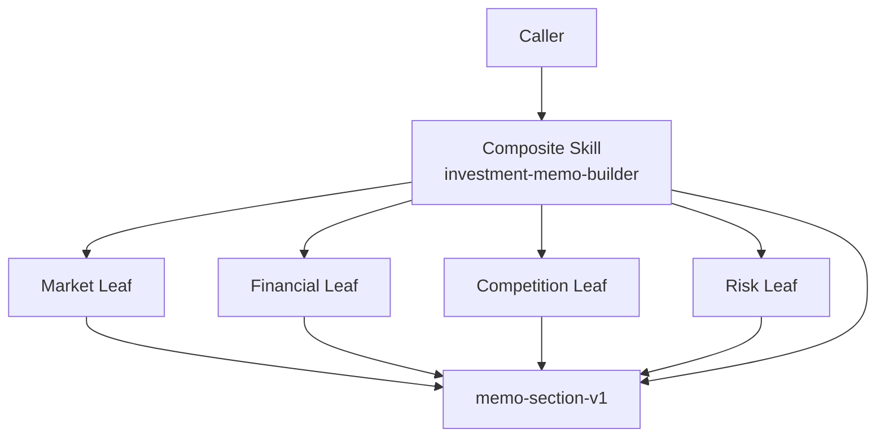

# 组合模式（Composite）

## 一眼看懂 / At a glance

**一句话：** 原子 Skill 和组合 Skill 返回同一种结果，所以调用者可以把整棵树当成一个 Skill 使用。



| | Case Skill（上游案例） | Mock sample（本仓库构造） |
| --- | --- | --- |
| **是哪一个** | [OpenMontage animation pipeline](https://github.com/calesthio/OpenMontage/blob/db91727598d08d40919d7d68a47864a5467bd448/pipeline_defs/animation.yaml) | [`investment-memo-builder`](sample/SKILL.md) |
| **哪里体现模式** | pipeline 把多个 stage Skills 组织成一个工作流（候选对应） | root 和四个 Leaf 共用 `memo-section-v1`，形成可验证树 |
| **怎么运行** | 由 OpenMontage pipeline loader 解析 | `python3 sample/scripts/run_demo.py` |

**看哪三个文件：** `sample/SKILL.md`、`sample/child-skills/`、`sample/references/section-contract.md`。

## 直接看实现 / Direct evidence

### Case Skill：上游实现的关键行为

下面是根据固定版本 OpenMontage pipeline definition、stage Skills 和 loader 整理的**规范化行为片段**，不是上游原文复制：

```text
# normalized Case Skill behavior
pipeline.animation:
  stages: [executive-producer, research-director, ...]

pipeline_loader:
  resolve each stage Skill
  execute the declared stage graph
```

模式信号：多个 Skill 被组织成一个更大的工作流。由于上游没有证明统一 Leaf/Composite 契约，本案例保持 candidate correspondence。

### Mock sample：本仓库实际 Skill

```text
patterns/composite/sample/
├── SKILL.md                         # root Composite
├── child-skills/
│   ├── market-analysis/SKILL.md      # Leaf
│   ├── financial-analysis/SKILL.md   # Leaf
│   ├── competition-analysis/SKILL.md # Leaf
│   └── risk-analysis/SKILL.md        # Leaf
├── references/section-contract.md   # shared Component contract
└── scripts/run_demo.py               # tree validation + assembly
```

```markdown
<!-- Composite: root and leaves share one result shape. -->
## Component contract

Every node returns exactly `id`, `title`, `content`, `evidence`, and `children`.
A Leaf returns `children: []`; the root returns the same shape containing its
validated child records.

## Agent mode

Validate one rooted tree, invoke each Leaf in declared order, validate its
record, then assemble the root Component.
```

这段 mock Skill 直接对应 Composite 的核心：统一接口、递归包含关系、整体和部分可用同一方式处理。

This record transfers the canonical Gang of Four Composite pattern to
Skillware. It maps the task caller to Client, `memo-section-v1` to Component,
four independently inspectable analysis Skills to Leaves, and the root
investment-memo Skill plus serialized containment workflow to Composite.

The standalone sample is **Investment Memo Builder / 投资备忘录生成**. Every
node returns exactly `id`, `title`, `content`, `evidence`, and `children`.
Leaves return `children: []`; the root returns the same record shape with the
four child records in declared order. In Agent mode the root invokes the child
Skills. In demo mode deterministic executors keyed by those Skill paths compute
the same Leaf contract from serialized inputs; Python does not interpret
`SKILL.md`.

- [English definition](definition.md)
- [中文定义](definition.zh-CN.md)
- [Participant map](participant-map.yaml)
- [Open-source correspondence](correspondence.md)
- [Runnable sample](sample/)
- [Misuse discriminator](misuse/explanation.md)

## Case Skill: upstream implementation

**Case Skill:** OpenMontage's animation pipeline Skills, including
`skills/pipelines/animation/executive-producer.md` and
`skills/pipelines/animation/research-director.md`.

The high-star comparison is [calesthio/OpenMontage](https://github.com/calesthio/OpenMontage):
`pipeline_defs/animation.yaml` composes the stage Skills
`skills/pipelines/animation/executive-producer.md` and
`skills/pipelines/animation/research-director.md`, resolved by
`lib/pipeline_loader.py`. This remains a candidate correspondence, with exact
paths in the [upstream evidence record](../../docs/upstream-skill-evidence.md#composite--组合模式).
The local demo makes the shared Leaf/Composite result contract explicit in
[`sample/SKILL.md`](sample/SKILL.md).

## Mock sample Skill: this repository

**Mock Skill:** [`sample/SKILL.md`](sample/SKILL.md), named
`investment-memo-builder`. Its four child Skills produce market, financial,
competition, and risk sections; the root returns the same `memo-section-v1`
shape while containing those child records.

The Composite idea is implemented by uniform Leaf/Composite results and a
validated rooted tree. Run `python3 sample/scripts/run_demo.py`; inspect
[`sample/child-skills/`](sample/child-skills/) and
[`participant-map.yaml`](participant-map.yaml).

The local sample is constructive evidence. OpenMontage staged Skill workflows
are only a **candidate correspondence** because the frozen public evidence does
not establish a uniform Leaf/Composite result contract or explicit part-whole
tree. The pinned animation pipeline uses different stage artifact schemas, and
the relation may instead be a pipeline dependency graph. Neither claim
establishes ecosystem frequency or comparative benefit.
