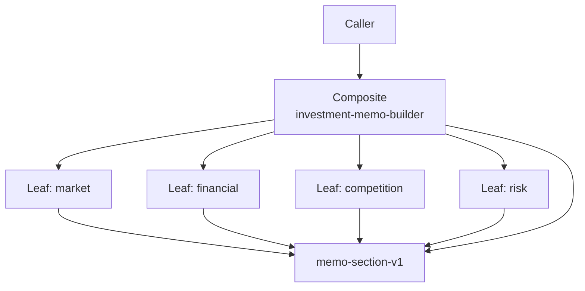

# 组合模式 / Composite

> **Scenario / 场景:** Investment Memo Builder / 投资备忘录生成

## 1. 先看问题 / The problem

An investment memo has market, financial, competition, and risk sections. If
the root Skill and each section return unrelated shapes, the caller must know
which nodes are leaves and which node is the root:

```text
caller -> special handling for market
caller -> special handling for financial
caller -> special handling for the memo root
```

## 2. 模式一句话 / Pattern in one sentence

**Give atomic and composed Skills one shared result contract so a caller can
treat a single node and a whole tree uniformly.**



Every node returns `id`, `title`, `content`, `evidence`, and `children`.

## 3. 现实中的 Skill / Existing Skill case

**Case Skill:** [OpenMontage animation pipeline](https://github.com/calesthio/OpenMontage/blob/db91727598d08d40919d7d68a47864a5467bd448/pipeline_defs/animation.yaml) and its stage Skills loaded by the [pipeline loader](https://github.com/calesthio/OpenMontage/blob/db91727598d08d40919d7d68a47864a5467bd448/lib/pipeline_loader.py). **Status: candidate correspondence.**

What the case does: a pipeline definition names multiple stage Skills and a
loader executes the declared workflow.

```text
animation pipeline
  -> research stage Skill
  -> production stage Skill
  -> output artifact
```

The source shows composition. The frozen files do not establish one complete
Leaf/Composite result contract, so the correspondence stays candidate-level.

## 4. 本仓库的 Mock Skill / Mock Skill

Our concrete example is `investment-memo-builder`:

```text
patterns/composite/sample/
├── SKILL.md                                  # Composite root
├── child-skills/
│   ├── market-analysis/SKILL.md              # Leaf
│   ├── financial-analysis/SKILL.md           # Leaf
│   ├── competition-analysis/SKILL.md         # Leaf
│   └── risk-analysis/SKILL.md                # Leaf
├── references/section-contract.md
├── scripts/run_demo.py
└── tests/test_demo.py
```

The important part of [`sample/SKILL.md`](sample/SKILL.md) is:

```markdown
<!-- Composite: root and leaves return the same recursive shape. -->
Leaf  -> {id, title, content, evidence, children: []}
Root  -> {id, title, content, evidence, children: [validated leaves]}

Validate every child record before assembling the root memo.
```

## 5. 角色对应 / Role mapping

| GoF role | Skillware carrier in this example |
| --- | --- |
| Client | memo caller |
| Component | `memo-section-v1` |
| Leaf | four analysis Skills |
| Composite | root `investment-memo-builder` |

## 6. 什么时候使用 / When to use

| Use Composite when | Keep it simple when |
| --- | --- |
| a whole Skill and its parts share one interface | root and parts have unrelated contracts |
| callers should traverse a tree without special cases | the workflow is a flat sequence |
| child Skills can be independently addressed and validated | there is no meaningful part-whole relation |

## 7. 运行与验证 / Run and inspect

```bash
python3 sample/scripts/run_demo.py
python3 -m unittest discover -s sample/tests -v
```

Read the [complete sample](sample/), [participant map](participant-map.yaml),
[definition](definition.md), and [misuse case](misuse/explanation.md).

## 8. 证据边界 / Evidence boundary

The local sample proves the recursive contract and tree validation. OpenMontage
is recorded as candidate correspondence; it does not prove uniform
Leaf/Composite semantics or comparative benefit.
