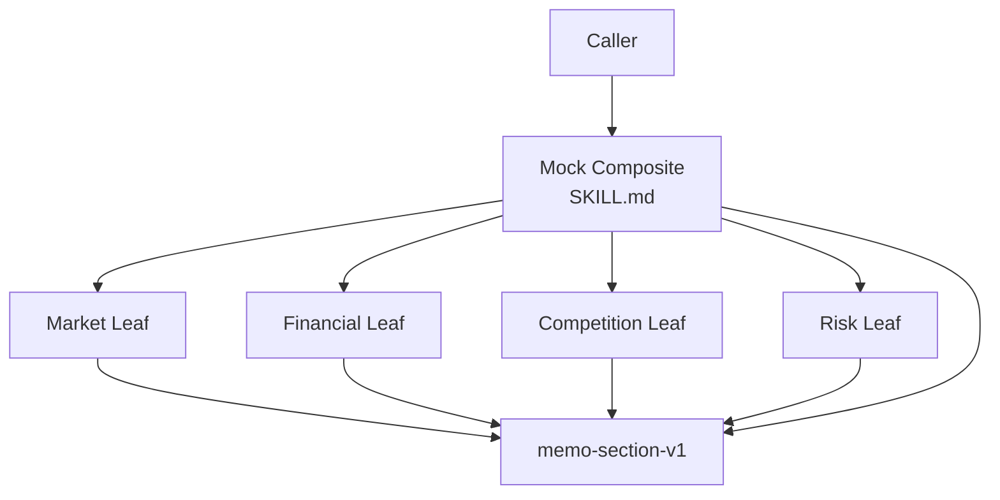

# Investment Memo Builder

> **This directory is the mock sample.** It demonstrates the Composite idea
> with a deterministic memo tree; it is not the OpenMontage pipeline.

## Evidence at a glance



| Evidence layer | Open this | What proves the Composite relation |
| --- | --- | --- |
| **Upstream case** | [OpenMontage pipeline](https://github.com/calesthio/OpenMontage/blob/db91727598d08d40919d7d68a47864a5467bd448/pipeline_defs/animation.yaml) | Multiple stage Skills are assembled by a pipeline loader (candidate correspondence). |
| **Mock Composite** | [`SKILL.md#agent-mode`](SKILL.md#agent-mode) | The root validates a tree, invokes Leaves, and returns the same Component shape. |
| **Leaf Skills** | [`child-skills/`](child-skills/) · [`references/section-contract.md`](references/section-contract.md) | Every atomic analysis returns `memo-section-v1` with `children: []`. |
| **Executable proof** | [`scripts/run_demo.py`](scripts/run_demo.py) · [`tests/test_demo.py`](tests/test_demo.py) | Tree validation rejects cycles, shared children, and invalid results. |

**The pattern-bearing line is:** root Component → validated child tree → child
Components with the same result contract.

## Mock Skill source

```text
sample/
├── SKILL.md
├── child-skills/{market,financial,competition,risk}-analysis/SKILL.md
├── references/section-contract.md
├── scripts/run_demo.py
└── tests/test_demo.py
```

```markdown
<!-- Composite: every node can be handled as memo-section-v1. -->
Leaf:  {id, title, content, evidence, children: []}
Root:  {id, title, content, evidence, children: [validated Leaves]}

The root validates the tree before any Leaf executes.
```

## Learn the pattern

### Before: the root knows every section shape

```text
root -> market() -> special market result
root -> finance() -> different finance result
root -> risk() -> another wrapper shape
```

The root becomes coupled to every section and cannot treat a nested memo as one
section.

### After: Leaves and Composite share one Component contract

```text
memo-section-v1(root)
  └── memo-section-v1(leaf)
```

### Use it when

| Use Composite when | Keep it simple when |
| --- | --- |
| a real part-whole tree exists | the workflow is a flat sequence of different stages |
| callers should handle leaf and tree uniformly | child outputs cannot share a meaningful contract |
| nested composition is expected | a graph has shared children or cross-links |

### Skill-author recipe

1. Define one Component result before writing any Leaf.
2. Make each Leaf independently invocable.
3. Make the root validate the tree before execution.
4. Reject cycles, shared children, and incompatible result shapes.

## Scenario

An investment team needs one memo with market, financial, competition, and
risk sections. Each section is produced independently, but the final memo must
remain a validated tree that can be inspected or extended one section at a
time.

## Why this is Composite

Leaves and the root expose the same `memo-section-v1` record. The root can be
handled as a Component while recursively containing Leaf Components; the
relationship is the validated workflow tree, not the directory layout.

| GoF role | Skillware carrier in this example |
| --- | --- |
| Client | Caller of the investment-memo root Skill |
| Component | `references/section-contract.md` |
| Leaf | Four analysis child Skills |
| Composite | Root `sample/SKILL.md` and the investment memo node |

## Contract

Input: a node registry with one root and declared child references. Output: one
`memo-section-v1` tree where every node has `id`, `title`, `content`, `evidence`,
and `children`. Cycles, shared children, disconnected nodes, and invalid child
results fail before an invalid memo is returned.

## Where to look

- [Root Skill](SKILL.md) explains tree validation and child invocation.
- [Section contract](references/section-contract.md) is the common Component interface.
- `scripts/run_demo.py` is the oracle; `child-skills/` contains the four Leaf Skills.

Run the default valid workflow from this directory:

```bash
python3 scripts/run_demo.py
```

Run an explicit workflow fixture:

```bash
python3 scripts/run_demo.py fixtures/valid/investment-memo.json
```

Run the focused tests:

```bash
python3 -m unittest discover tests -v
```

The demo requires Python 3.10 or newer, uses only the standard library, needs
no network, and imports no shared pattern code. Four deterministic executors
are keyed to the child Skill paths and compute Leaf results from fixture input;
Python does not interpret `SKILL.md`. The builder supports injected executors,
validates every returned record, preserves call order, and does not mutate the
workflow.

Whole-registry validation rejects missing references, repeated children,
shared-child DAGs, roots with parents, unreachable nodes, and cycles even in
disconnected components before any Leaf executes.

The JSON workflow is a node registry plus child references; the directory
layout itself is not the Composite relation. The relation comes from uniform
Component results and validated part-whole traversal.
