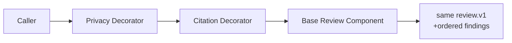

# 装饰模式 / Decorator

> **Scenario / 场景:** Contract Review Enhancers / 合同审查增强

## 1. 先看问题 / The problem

A contract review needs a base review plus optional privacy, citation, and
compliance checks. Copying the base Skill into every combination creates many
variants:

```text
base review
base + privacy
base + citation
base + privacy + citation + compliance
```

## 2. 模式一句话 / Pattern in one sentence

**Wrap one shared Component contract to add behavior while preserving the
original request and result shape.**



Decorators can be stacked in the requested order.

## 3. 现实中的 Skill / Existing Skill case

**Case Skill:** [Caveman Skill](https://github.com/JuliusBrussee/caveman/blob/25d22f864ad68cc447a4cb93aefde918aa4aec9f/skills/caveman/SKILL.md) and its [activation hook](https://github.com/JuliusBrussee/caveman/blob/25d22f864ad68cc447a4cb93aefde918aa4aec9f/src/hooks/caveman-activate.js). **Status: candidate correspondence.**

What the case does: an activation hook adds behavior around an existing Skill
interaction surface.

```text
Host activation -> caveman wrapper -> existing Skill interaction
```

The paths show wrapping at activation. A complete GoF Component/Decorator
contract is not declared in the inspected release.

## 4. 本仓库的 Mock Skill / Mock Skill

Our concrete example is `contract-review-enhancers`:

```text
patterns/decorator/sample/
├── SKILL.md                                  # root composition
├── child-skills/
│   ├── base-review/SKILL.md                   # Component
│   ├── privacy-check/SKILL.md                 # Decorator 1
│   ├── citation-check/SKILL.md                # Decorator 2
│   └── compliance-check/SKILL.md              # Decorator 3
├── references/contract-review-component.md
├── scripts/run_demo.py
└── tests/test_demo.py
```

The important part of [`sample/SKILL.md`](sample/SKILL.md) is:

```markdown
<!-- Decorator: every wrapper delegates to the same review.v1 Component. -->
base = Base Contract Review
for decorator in requested order:
    base = decorator.wrap(base)
invoke the final Component once
return the same `summary` and `findings` fields
```

## 5. 角色对应 / Role mapping

| GoF role | Skillware carrier in this example |
| --- | --- |
| Component | `contract-review-v1` base Skill contract |
| ConcreteComponent | `base-review` Skill |
| Decorator | privacy, citation, and compliance wrapper Skills |
| Client | contract-review caller |

## 6. 什么时候使用 / When to use

| Use Decorator when | Keep it simple when |
| --- | --- |
| optional responsibilities can be stacked around one contract | every caller needs one fixed behavior |
| combinations would otherwise produce many Skill variants | the wrapper changes the public contract |
| wrapper order has a documented meaning | inheritance or one simple rule is clearer |

## 7. 运行与验证 / Run and inspect

```bash
python3 sample/scripts/run_demo.py --decorators privacy-check,citation-check
python3 -m unittest discover -s sample/tests -v
```

Read the [complete sample](sample/), [participant map](participant-map.yaml),
[definition](definition.md), and [misuse case](misuse/explanation.md).

## 8. 证据边界 / Evidence boundary

The local sample verifies wrapper order, one base invocation, and contract
preservation. Caveman remains candidate correspondence; its hook does not prove
full Component/Decorator substitutability.
