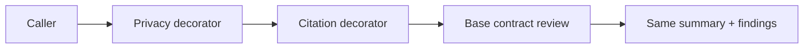

# Decorator / 装饰模式

## 一眼看懂 / At a glance

**一句话：** 在不改变原 Skill 接口的前提下，外面再包一层额外能力。



| | Case Skill（上游案例） | Mock sample（本仓库构造） |
| --- | --- | --- |
| **是哪一个** | [Caveman Skill](https://github.com/JuliusBrussee/caveman/blob/25d22f864ad68cc447a4cb93aefde918aa4aec9f/skills/caveman/SKILL.md) + [activation hook](https://github.com/JuliusBrussee/caveman/blob/25d22f864ad68cc447a4cb93aefde918aa4aec9f/src/hooks/caveman-activate.js) | [`contract-review-enhancers`](sample/SKILL.md) |
| **哪里体现模式** | activation hook 在现有 Host 交互外增加行为（候选对应） | Privacy/Citation/Compliance wrapper 委托 Base Component 并追加 finding |
| **怎么运行** | 由 Caveman activation hook 触发 | `python3 sample/scripts/run_demo.py --decorators privacy-check,citation-check` |

**看哪三个文件：** `sample/SKILL.md`、`sample/child-skills/`、`sample/references/contract-review-component.md`。

## 直接看实现 / Direct evidence

### Case Skill：上游实现的关键行为

下面是根据固定版本 Caveman activation hook 和 Caveman Skill 整理的**规范化行为片段**，不是上游原文复制：

```text
# normalized Case Skill behavior
existing Host/session interaction
  -> caveman-activate.js adds activation behavior
  -> skills/caveman/SKILL.md remains the user-facing surface
```

模式信号：在既有交互表面外增加行为。本案例没有充分证明标准 Component/Decorator 结果契约，因此保持 candidate correspondence。

### Mock sample：本仓库实际 Skill

```text
patterns/decorator/sample/
├── SKILL.md                         # wrapper composition policy
├── child-skills/
│   ├── base-contract-review/SKILL.md # ConcreteComponent
│   ├── privacy-check/SKILL.md         # ConcreteDecorator
│   ├── citation-check/SKILL.md        # ConcreteDecorator
│   └── compliance-check/SKILL.md      # ConcreteDecorator
├── references/contract-review-component.md
└── scripts/run_demo.py               # wrapper oracle
```

```markdown
<!-- Decorator: delegate once, preserve the Component contract, add one concern. -->
1. Start with `base_review`.
2. Wrap it with the requested decorators in order.
3. Invoke the resulting Component once.
4. Preserve `summary` and append only the wrapper's finding.
```

这段 mock Skill 直接对应 Decorator 的核心：包装而不替换，叠加而不复制基础逻辑。

This record transfers the canonical Gang of Four Decorator pattern to Skillware
through Contract Review Enhancers / 合同审查增强. `contract-review-v1` is the
Component, Base Contract Review is the ConcreteComponent, the shared wrapper
protocol is the Decorator, and Privacy Check, Citation Check, and optional
Compliance Check are ConcreteDecorators.

The default composition is
`with_citation_check(with_privacy_check(base_review))`. It accepts exactly
`text` and returns exactly `summary` and `findings`; base findings precede
privacy, which precedes citation. Compliance is available but excluded from
that exact plan default. Reversing nesting reverses only the enabled
enhancements. Every wrapper delegates once, preserves the wrapped summary and
failure, copies values at participant boundaries, and suppresses an already
present identical `(type, message)` finding.

- [English definition](definition.md)
- [中文定义](definition.zh-CN.md)
- [Participant map](participant-map.yaml)
- [Correspondence assessment](correspondence.md)
- [Runnable sample](sample/)
- [Misuse discriminator](misuse/explanation.md)

## Case Skill: upstream implementation

**Case Skill:** Caveman's `skills/caveman/SKILL.md`, activated and wrapped by
`src/hooks/caveman-activate.js`.

The high-star comparison is [JuliusBrussee/caveman](https://github.com/JuliusBrussee/caveman):
`src/hooks/caveman-activate.js` adds activation/session behavior around the
`skills/caveman/SKILL.md` surface. This is candidate correspondence because
the common Component result and explicit delegate boundary are not fully
observable; see the [pinned evidence record](../../docs/upstream-skill-evidence.md#decorator--装饰模式).
The local demo gives each wrapper a complete contract-preserving Skill.

## Mock sample Skill: this repository

**Mock Skill:** [`sample/SKILL.md`](sample/SKILL.md), named
`contract-review-enhancers`. It starts with `base-contract-review` and wraps
it with `privacy-check`, `citation-check`, or `compliance-check`.

The Decorator idea is implemented by each wrapper delegating once, preserving
`contract-review-v1`, and adding only its own finding. Run
`python3 sample/scripts/run_demo.py --decorators privacy-check,citation-check`;
the mapping is in [`participant-map.yaml`](participant-map.yaml).

The local sample is **constructive** evidence. Caveman is a **candidate
correspondence** at one fixed public revision: its activation hook adds
behavior around session start while preserving its process/stdout Host
interaction surface, but the inspected paths do not establish complete GoF
Component contract equivalence or runtime behavior. Neither claim establishes
ecosystem frequency, legal review quality, cross-Host equivalence, Agent
Runtime interpretation, or comparative benefit.
