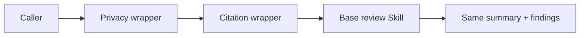

# Contract Review Enhancers

> **This directory is the mock sample.** It demonstrates the Decorator idea
> with contract review wrappers; it is not the Caveman activation hook.

## Evidence at a glance



| Evidence layer | Open this | What proves the Decorator relation |
| --- | --- | --- |
| **Upstream case** | [Caveman Skill](https://github.com/JuliusBrussee/caveman/blob/25d22f864ad68cc447a4cb93aefde918aa4aec9f/skills/caveman/SKILL.md) + [activation hook](https://github.com/JuliusBrussee/caveman/blob/25d22f864ad68cc447a4cb93aefde918aa4aec9f/src/hooks/caveman-activate.js) | Activation adds behavior around the existing Host surface (candidate correspondence). |
| **Mock Component** | [`SKILL.md#agent-mode`](SKILL.md#agent-mode) | The root composes wrappers without replacing the base review contract. |
| **Decorators** | [`child-skills/`](child-skills/) · [`references/contract-review-component.md`](references/contract-review-component.md) | Each wrapper delegates once and appends only its own finding. |
| **Executable proof** | [`scripts/run_demo.py`](scripts/run_demo.py) · [`tests/test_demo.py`](tests/test_demo.py) | Tests prove order, interface preservation, and idempotency. |

**The pattern-bearing line is:** wrapper → wrapped Component → same interface +
one added responsibility.

## Mock Skill source

```text
sample/
├── SKILL.md
├── child-skills/{base-contract-review,privacy-check,citation-check,compliance-check}/SKILL.md
├── references/contract-review-component.md
├── scripts/run_demo.py
└── tests/test_demo.py
```

```markdown
<!-- Decorator: call the wrapped Component once, then add one finding. -->
base_review(text)
  -> privacy_check(base_result)
  -> citation_check(privacy_result)
  -> same summary + ordered findings
```

## Scenario

A base contract review should remain unchanged while a caller optionally adds
privacy, citation, or compliance checks. Enhancements must compose in a chosen
order and must not duplicate the base review logic.

## Why this is Decorator

Every wrapper holds a Component, delegates exactly once, preserves the same
`contract-review-v1` interface, and adds one bounded responsibility. A wrapper
is not a replacement workflow or a hook that ignores the wrapped result.

| GoF role | Skillware carrier in this example |
| --- | --- |
| Component | `contract-review-v1` in `references/contract-review-component.md` |
| ConcreteComponent | `base-contract-review` child Skill |
| Decorator | Contract-preserving wrapper protocol in the root Skill |
| ConcreteDecorator | `privacy-check`, `citation-check`, and `compliance-check` |

## Contract

Input: one `text` field. Output: exactly `summary` and ordered `findings`.
The default is `base -> privacy -> citation`; wrapper order changes only the
enhancement order. Wrapped failures propagate without partial results.

## Where to look

- [Root Skill](SKILL.md) defines composition and preservation rules.
- [Component contract](references/contract-review-component.md) defines the shared interface.
- `scripts/run_demo.py` and `--decorators` make wrapper composition observable.

This standalone sample realizes Decorator with one exact
`contract-review-v1` Component interface. Base Contract Review is the
ConcreteComponent. Privacy Check and Citation Check are composable
ConcreteDecorators. Optional Compliance Check is a third ConcreteDecorator.
Every participant accepts exactly `text` and returns exactly `summary` and
`findings`.

Run:

```bash
python3 scripts/run_demo.py
python3 scripts/run_demo.py fixtures/valid/clean-contract.json
python3 scripts/run_demo.py --decorators citation-check,privacy-check
python3 scripts/run_demo.py --decorators privacy-check,citation-check,compliance-check
python3 -m unittest discover tests -v
```

The default composition is
`with_citation_check(with_privacy_check(base_review))`. Delegation returns the
base result first; Privacy Check appends its finding; Citation Check appends
last. Reversing the wrapper order reverses only those enhancements. Each
boundary validates and copies input and output, so the caller, wrapped
Component, and wrapper cannot mutate one another's owned values. Exact
`(type, message)` identity makes repeated identical wrappers idempotent. The
contract bounds individual strings and nesting depth but does not cap the
finding array, preserving substitution under additional wrapper composition.

The demo uses only the Python standard library and makes no network or model
calls. JSON fixtures pin exact success output and stable errors for malformed
JSON, duplicate members, exact fields and types, blank text, lone Unicode
surrogates, and excessive depth. Focused programmatic tests cover invalid
UTF-8, non-string mapping keys, cyclic values, parser recursion, per-string
bounds, more than 100 findings and wrappers, duplicate finding identity and
idempotency, and alias isolation. Python is a deterministic oracle, not a
legal, privacy, citation, or compliance review system and not evidence of Agent
Runtime interpretation.
