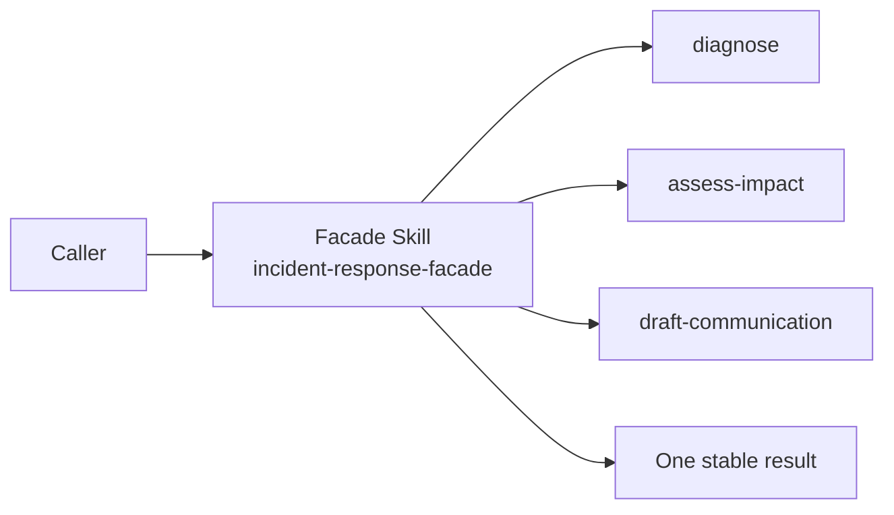

# 外观模式（Facade）

## 一眼看懂 / At a glance

**一句话：** 调用者只面对一个入口 Skill，入口 Skill 隐藏多个专家 Skill 的调用顺序。



| | Case Skill（上游案例） | Mock sample（本仓库构造） |
| --- | --- | --- |
| **是哪一个** | [Superpowers `using-superpowers`](https://github.com/obra/superpowers/blob/896224c4b1879920ab573417e68fd51d2ccc9072/skills/using-superpowers/SKILL.md) | [`incident-response-facade`](sample/SKILL.md) |
| **哪里体现模式** | 一个入口策略负责发现、选择并调用其他 Skills | 一个入口 Skill 编排三个专家 Skill，并隐藏内部顺序 |
| **怎么运行** | 上游 Host hook 激活它 | `python3 sample/scripts/run_demo.py` |

**看哪三个文件：** `sample/SKILL.md`、`sample/child-skills/`、`participant-map.yaml`。

## 直接看实现 / Direct evidence

### Case Skill：上游实现的关键行为

下面是根据固定版本 `using-superpowers/SKILL.md`、session hook 和 hook 配置整理的**规范化行为片段**，用于直接展示模式信号，不是上游原文复制：

```text
# normalized Case Skill behavior
on session start:
  load the bootstrap policy                 # one public entry point
  discover the relevant specialist Skills  # subsystem discovery
  select and invoke the needed Skills      # caller does not orchestrate them
```

模式信号：一个入口 Skill 负责选择和调用多个专家 Skill。

### Mock sample：本仓库实际 Skill

```text
patterns/facade/sample/
├── SKILL.md                         # root Facade: public incident contract
├── child-skills/
│   ├── diagnose/SKILL.md             # subsystem 1
│   ├── assess-impact/SKILL.md        # subsystem 2
│   └── draft-communication/SKILL.md  # subsystem 3
├── scripts/run_demo.py               # deterministic oracle
└── tests/test_demo.py                # order + fallback checks
```

```markdown
<!-- Facade: one public operation hides specialist orchestration. -->
## Orchestration

For `5xx spike`:
1. Use `child-skills/diagnose/SKILL.md`.
2. Pass its result to `child-skills/assess-impact/SKILL.md`.
3. Pass the impact result to `child-skills/draft-communication/SKILL.md`.
4. Return only `summary`, `impact`, `actions`, and `communication`.

## Fallback

For an unknown signal, preserve the public result contract and return
`actions: ["request-human-triage"]`.
```

这段 mock Skill 直接对应 Facade 的核心：稳定入口、隐藏子系统顺序、统一输出和统一回退。

This record transfers the Gang of Four Facade pattern to Skillware. It maps a
stable entry Skill to the Facade, independently addressable specialist Skills
to the subsystem, and the operator or task-level agent execution to the
Client.

The standalone sample is **Production Incident Response / 生产事故响应**. Its
root Skill accepts `service` and `signal`, coordinates three specialist Skills,
and always returns `summary`, `impact`, `actions`, and `communication`.

- [English definition](definition.md)
- [中文定义](definition.zh-CN.md)
- [Participant map](participant-map.yaml)
- [Open-source correspondence](correspondence.md)
- [Runnable sample](sample/)
- [Misuse discriminator](misuse/explanation.md)

## Case Skill: upstream implementation

**Case Skill:** `obra/superpowers/skills/using-superpowers/SKILL.md`.

The high-star comparison is [obra/superpowers](https://github.com/obra/superpowers):
`skills/using-superpowers/SKILL.md` is the stable entry policy, while
`hooks/session-start` and `hooks/hooks.json` activate it over specialist Skills.
The observation is pinned and qualified in the
[upstream evidence record](../../docs/upstream-skill-evidence.md#facade--外观模式).
The complete offline local analogue is [`sample/SKILL.md`](sample/SKILL.md).

## Mock sample Skill: this repository

**Mock Skill:** [`sample/SKILL.md`](sample/SKILL.md), named
`incident-response-facade`. It delegates to the `diagnose`, `assess-impact`,
and `draft-communication` child Skills before returning one stable result.

The Facade idea is implemented by hiding specialist order and fallback policy
behind one public operation. Run `python3 sample/scripts/run_demo.py`; the
participant relation is recorded in [`participant-map.yaml`](participant-map.yaml).

The constructive sample and the confirmed Superpowers correspondence are
separate evidence claims. Neither establishes ecosystem frequency,
cross-Host equivalence, or an improvement in quality.
