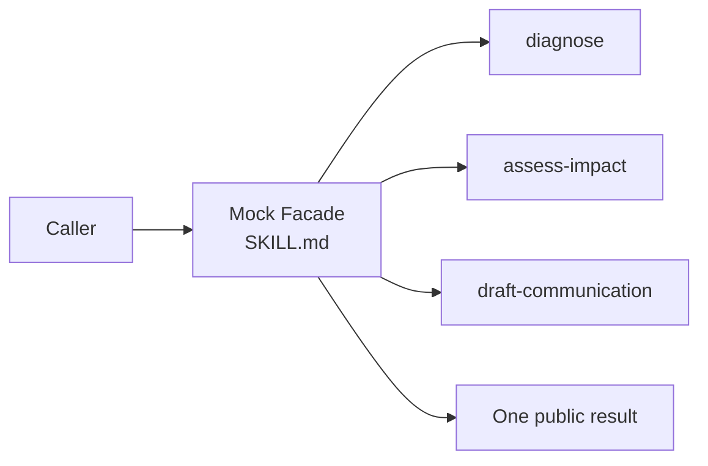

# Production Incident Response

> **This directory is the mock sample.** It demonstrates how the Facade idea
> is implemented in Skillware; it is not the upstream Superpowers Skill.

## Evidence at a glance



| Evidence layer | Open this | What proves the Facade relation |
| --- | --- | --- |
| **Upstream case Skill** | [Superpowers `using-superpowers`](https://github.com/obra/superpowers/blob/896224c4b1879920ab573417e68fd51d2ccc9072/skills/using-superpowers/SKILL.md) | One entry policy discovers and invokes specialist Skills. |
| **Mock Facade** | [`SKILL.md#orchestration`](SKILL.md#orchestration) | One public incident operation owns the specialist sequence and fallback. |
| **Subsystem Skills** | [`child-skills/`](child-skills/) | Diagnosis, impact, and communication are separate callable responsibilities. |
| **Executable proof** | [`scripts/run_demo.py`](scripts/run_demo.py) · [`tests/test_demo.py`](tests/test_demo.py) | The oracle and tests verify call order, one result contract, and fallback. |

**The pattern-bearing line is:** caller → root `SKILL.md` → three child Skills →
one stable result. That is the implementation evidence; the incident topic is
only the concrete scenario.

## Scenario

An on-call operator sees a `5xx spike` for `checkout-api` and wants one
incident response instead of manually coordinating several specialist Skills.
The demo produces diagnosis, customer impact, immediate actions, and a status
update from one request.

## Why this is Facade

The caller sees one stable `incident-response-facade` operation. The root Skill
owns the public contract and delegates to three hidden subsystem Skills. The
caller does not select or know the specialist sequence.

| GoF role | Skillware carrier in this example |
| --- | --- |
| Client | Operator or task-level caller |
| Facade | `sample/SKILL.md` |
| Subsystem | `diagnose`, `assess-impact`, and `draft-communication` child Skills |

## Contract

Input: `{"service": "checkout-api", "signal": "5xx spike"}`.
Output: exactly `summary`, `impact`, `actions`, and `communication`.
Unknown signals keep the same output shape and request human triage instead of
inventing a diagnosis.

## Where to look

- [Root Skill](SKILL.md) defines the public operation and orchestration.
- [Participant map](../participant-map.yaml) records the Client, Facade, and Subsystem roles.
- `scripts/run_demo.py` is the deterministic oracle; `tests/test_demo.py` verifies call order and fallback.

This standalone Facade sample accepts `service` and `signal` through one root
Skill. It coordinates independently inspectable diagnosis, impact, and
communication Skills while returning only `summary`, `impact`, `actions`, and
`communication`.

From this directory, run the known-signal fixture:

```bash
python3 scripts/run_demo.py
```

Run another fixture:

```bash
python3 scripts/run_demo.py fixtures/invalid/unknown-signal.json
```

Run the focused tests:

```bash
python3 -m unittest discover tests -v
```

The demo requires Python 3.10 or newer, uses only the standard library, needs
no network or credentials, and imports no other pattern sample. A malformed
fixture exits nonzero with a validation error.
