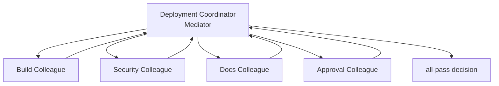

# 中介者模式 / Mediator

> **Scenario / 场景:** Deployment Coordinator / 部署协调

## 1. 先看问题 / The problem

Build, security, documentation, and approval checks all contribute to one
release decision. Peer-to-peer calls make every check depend on every other
check:

```text
build <-> security <-> docs <-> approval
```

Adding a fifth check multiplies coordination paths.

## 2. 模式一句话 / Pattern in one sentence

**A central coordinator carries communication among specialist Skills so the
specialists do not call one another.**



## 3. 现实中的 Skill / Existing Skill case

**Case Skill:** [Anthropic GL reconciler coordinator](https://github.com/anthropics/financial-services/blob/4aa51ed3d379731f8f9beff498d749580372699c/managed-agent-cookbooks/gl-reconciler/agent.yaml) and its [reader/critic/resolver subagents](https://github.com/anthropics/financial-services/tree/4aa51ed3d379731f8f9beff498d749580372699c/managed-agent-cookbooks/gl-reconciler/subagents). **Status: candidate correspondence.**

What the case does: a coordinator assigns work to specialist agents and
collects their reports for reconciliation.

```text
coordinator -> reader / critic / resolver
reader / critic / resolver -> coordinator
```

The source shows centralized coordination. A complete shared Colleague
contract remains unverified.

## 4. 本仓库的 Mock Skill / Mock Skill

Our concrete example is `deployment-coordinator`:

```text
patterns/mediator/sample/
├── SKILL.md                                  # Mediator
├── child-skills/
│   ├── build/SKILL.md                         # Colleague
│   ├── security/SKILL.md
│   ├── docs/SKILL.md
│   └── approval/SKILL.md
├── references/deployment-readiness-contract.md
├── scripts/run_demo.py
└── tests/test_demo.py
```

The important part of [`sample/SKILL.md`](sample/SKILL.md) is:

```markdown
<!-- Mediator: Colleagues report to the center; they never call peers. -->
1. invoke build, security, docs, and approval once
2. collect one readiness report from each Colleague
3. isolate a failed report
4. apply one all-pass release policy
```

## 5. 角色对应 / Role mapping

| GoF role | Skillware carrier in this example |
| --- | --- |
| Mediator | root deployment coordinator Skill |
| ConcreteMediator | all-pass readiness policy |
| Colleague | build, security, docs, and approval Skills |

## 6. 什么时候使用 / When to use

| Use Mediator when | Keep it simple when |
| --- | --- |
| many specialists need coordinated interaction | two Skills have one direct call |
| peer coupling is growing with each new participant | the coordinator would absorb all domain logic |
| one policy should collect and reconcile reports | participants truly need direct collaboration |

## 7. 运行与验证 / Run and inspect

```bash
python3 sample/scripts/run_demo.py
python3 -m unittest discover -s sample/tests -v
```

Read the [complete sample](sample/), [participant map](participant-map.yaml),
[definition](definition.md), and [misuse case](misuse/explanation.md).

## 8. 证据边界 / Evidence boundary

The local sample verifies central dispatch, isolated failures, and the all-pass
decision. The Anthropic cookbook remains candidate correspondence and does not
establish a complete GoF Colleague interface.
