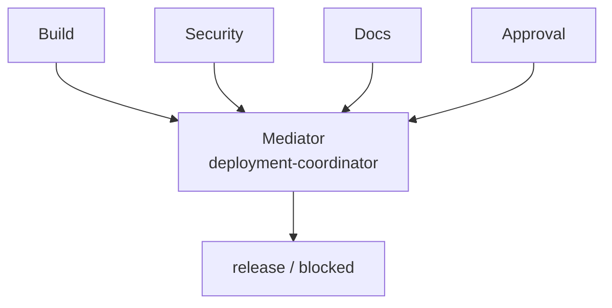

# 中介者模式（Mediator）

## 先看实际 Skill / Start here

**Case Skill（规范化片段）：**

```text
# upstream financial-services behavior sketch
GL coordinator -> reader / critic / resolver workers
```

**Mock Skill（本仓库）：**

```markdown
<!-- sample/SKILL.md: Colleagues report to one center. -->
build + security + docs + approval -> deployment-coordinator
all-pass policy is decided only by the coordinator
```

```text
sample/
├── SKILL.md
├── child-skills/{build,security,docs,approval}/SKILL.md
├── references/deployment-readiness-contract.md
└── tests/test_demo.py
```

## 一眼看懂 / At a glance

**一句话：** 多个专家 Skill 不互相调用，统一向一个协调 Skill 报告。



| | Case Skill（上游案例） | Mock sample（本仓库构造） |
| --- | --- | --- |
| **是哪一个** | [GL reconciler coordinator](https://github.com/anthropics/financial-services/blob/4aa51ed3d379731f8f9beff498d749580372699c/managed-agent-cookbooks/gl-reconciler/agent.yaml) + [reader/critic/resolver](https://github.com/anthropics/financial-services/tree/4aa51ed3d379731f8f9beff498d749580372699c/managed-agent-cookbooks/gl-reconciler/subagents) | [`deployment-coordinator`](sample/SKILL.md) |
| **哪里体现模式** | 一个中心 cookbook 协调多个 leaf workers（候选对应） | 四个 Colleague 只向 Coordinator 报告，Coordinator 独立做 all-pass 决策 |
| **怎么运行** | 由 cookbook coordinator 驱动 | `python3 sample/scripts/run_demo.py` |

**看哪三个文件：** `sample/SKILL.md`、`sample/child-skills/`、`sample/references/deployment-readiness-contract.md`。

## 直接看实现 / Direct evidence

### Case Skill：上游实现的关键行为

下面是根据固定版本 financial-services GL reconciler cookbook 整理的**规范化行为片段**，不是上游原文复制：

```text
# normalized Case Skill behavior
GL reconciler coordinator
  -> reader worker
  -> critic worker
  -> resolver worker
```

模式信号：多个 worker 通过中心 coordinator 协作，而不是互相调用。本案例没有充分证明共享 Colleague 契约，因此保持 candidate correspondence。

### Mock sample：本仓库实际 Skill

```text
patterns/mediator/sample/
├── SKILL.md                         # ConcreteMediator + all-pass policy
├── child-skills/
│   ├── build/SKILL.md                # Colleague
│   ├── security/SKILL.md             # Colleague
│   ├── docs/SKILL.md                 # Colleague
│   └── approval/SKILL.md             # Colleague
├── references/deployment-readiness-contract.md
└── scripts/run_demo.py               # binding + isolation oracle
```

```markdown
<!-- Mediator: Colleagues report to the center; they do not call peers. -->
1. Bind all four Colleagues after validating the complete set.
2. Address them once in `build, security, docs, approval` order.
3. Collect reports through the Mediator boundary.
4. Apply the all-pass release policy in the coordinator only.
```

这段 mock Skill 直接对应 Mediator 的核心：中心协调、同伴隔离、集中决策。

This record transfers the canonical Gang of Four Mediator pattern to Skillware.
It maps the coordination interface to **Mediator**, the central deployment
policy owner to **ConcreteMediator**, and the four isolated specialist Skills to
**Colleague**.

The standalone sample is **Deployment Coordinator / 部署协调**. Build,
security, documentation, and approval colleagues report one status each to the
central coordinator. They never invoke peers. The coordinator alone applies
the all-pass release policy and returns either `release` or `blocked`.

Start with [`definition.md`](definition.md), inspect the exact role mapping in
[`participant-map.yaml`](participant-map.yaml), then run the [`sample`](sample/).
The public correspondence remains candidate-only because the inspected
financial-services cookbook shows central orchestration and leaf workers but
does not establish a shared Colleague contract or runtime decision behavior.

## Case Skill: upstream implementation

**Case Skill:** the GL reconciler coordinator in
`anthropics/financial-services/managed-agent-cookbooks/gl-reconciler/agent.yaml`.

The high-star comparison is [anthropics/financial-services](https://github.com/anthropics/financial-services):
`managed-agent-cookbooks/gl-reconciler/agent.yaml` coordinates the isolated
`subagents/reader.yaml`, `subagents/critic.yaml`, and `subagents/resolver.yaml`
workers, with a reproducible check in `scripts/test-cookbooks.sh`. The exact
revision and candidate boundary are documented in the [upstream evidence
record](../../docs/upstream-skill-evidence.md#mediator--中介者模式). The local
demo makes the central status contract and no-peer rule executable.

## Mock sample Skill: this repository

**Mock Skill:** [`sample/SKILL.md`](sample/SKILL.md), named
`deployment-coordinator`. It addresses `build`, `security`, `docs`, and
`approval` child Skills and alone applies the all-pass release policy.

The Mediator idea is implemented by a single report boundary and no peer-to-peer
calls. Run `python3 sample/scripts/run_demo.py`; the mapping is in
[`participant-map.yaml`](participant-map.yaml).
