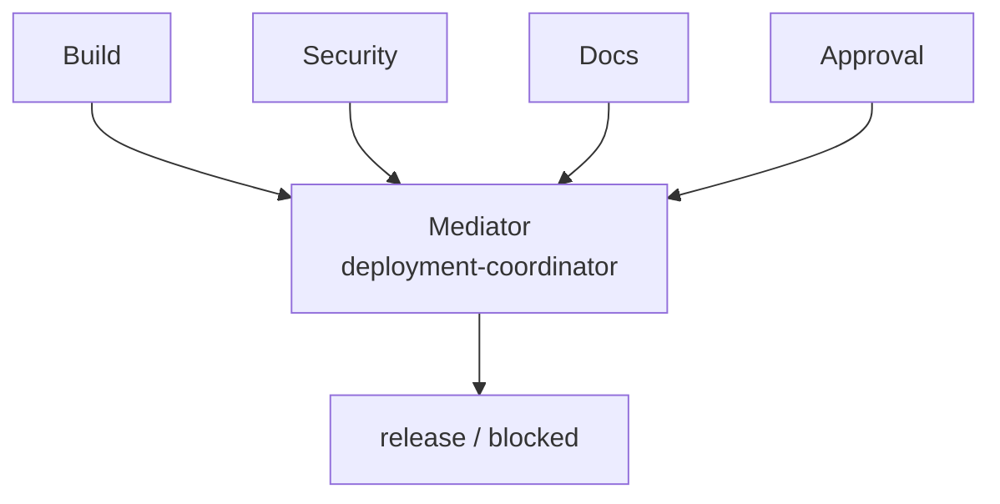

# Deployment Coordinator

> **This directory is the mock sample.** It demonstrates the Mediator idea
> with deployment readiness; it is not the financial-services cookbook.

## Evidence at a glance



| Evidence layer | Open this | What proves the Mediator relation |
| --- | --- | --- |
| **Upstream case** | [GL reconciler coordinator](https://github.com/anthropics/financial-services/blob/4aa51ed3d379731f8f9beff498d749580372699c/managed-agent-cookbooks/gl-reconciler/agent.yaml) + [subagents](https://github.com/anthropics/financial-services/tree/4aa51ed3d379731f8f9beff498d749580372699c/managed-agent-cookbooks/gl-reconciler/subagents) | A central cookbook coordinates isolated workers (candidate correspondence). |
| **Mock Mediator** | [`SKILL.md#agent-mode`](SKILL.md#agent-mode) | The coordinator binds, addresses, and isolates Colleagues, then decides readiness. |
| **Colleagues** | [`child-skills/`](child-skills/) · [`references/deployment-readiness-contract.md`](references/deployment-readiness-contract.md) | Each specialist reports through one shared boundary and has no peer reference. |
| **Executable proof** | [`scripts/run_demo.py`](scripts/run_demo.py) · [`tests/test_demo.py`](tests/test_demo.py) | Tests prove canonical order, failure isolation, and all-pass policy. |

**The pattern-bearing line is:** isolated Colleagues → one Mediator report
boundary → one release decision.

## Scenario

A release is ready only when build, security, documentation, and approval checks
all report `pass`. The checks must remain isolated and must not call each other
or decide the release independently.

## Why this is Mediator

The Deployment Coordinator is the ConcreteMediator. It owns the single report
boundary, addresses each Colleague once in canonical order, isolates failures,
and applies the all-pass policy. Colleagues know the Mediator, not one another.

| GoF role | Skillware carrier in this example |
| --- | --- |
| Mediator | `deployment-readiness-v1` report contract |
| ConcreteMediator | Root `deployment-coordinator` Skill |
| Colleague | `build`, `security`, `docs`, and `approval` child Skills |

## Contract

Input: exactly four statuses: `build`, `security`, `docs`, and `approval`.
Output: ordered reports and a release or blocked decision. Invalid status sets
fail before any Colleague is addressed; a specialist failure is isolated and
cannot be mistaken for readiness.

## Where to look

- [Root Skill](SKILL.md) defines binding, ordering, isolation, and policy.
- [Readiness contract](references/deployment-readiness-contract.md) defines the report boundary.
- `scripts/run_demo.py` and the security-failure fixture show centralized coordination.

This standalone Mediator sample coordinates build, security, documentation,
and approval Colleagues through one Deployment Coordinator. Every participant
is addressed once in canonical order and reports only to the Mediator. The
ConcreteMediator isolates callable failures, applies the all-pass policy, and
returns a deterministic release or blocked decision without doing specialist
work.

Run the deterministic default release-ready demo:

```bash
python3 scripts/run_demo.py
```

Run another bounded JSON workflow and the focused tests:

```bash
python3 scripts/run_demo.py fixtures/valid/security-failure.json
python3 -m unittest discover tests -v
```

The sample requires Python 3.10 or later, uses only the standard library, needs
no network or account, imports no shared pattern code, and does not modify its
fixtures. Binding and peer isolation are trusted-code contract boundaries, not
a security sandbox.
