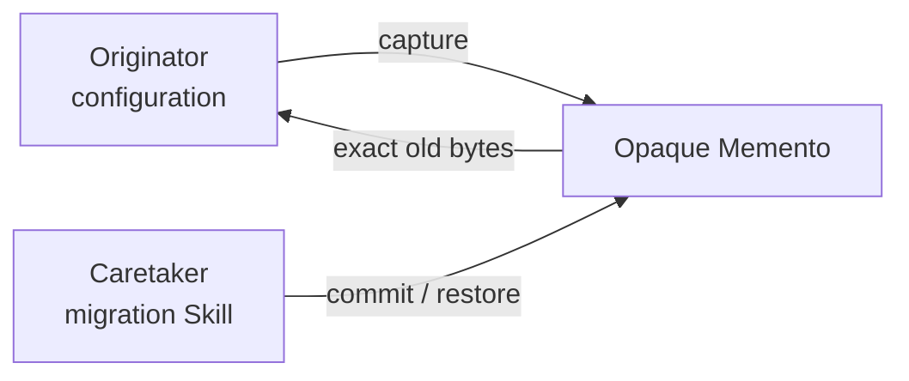

# 备忘录模式（Memento）

## 一眼看懂 / At a glance

**一句话：** 修改前保存一个外部不可见的旧状态，失败时恢复它。



| | Case Skill（上游案例） | Mock sample（本仓库构造） |
| --- | --- | --- |
| **是哪一个** | [SkillOpt staging.py](https://github.com/microsoft/SkillOpt/blob/b860a5cf88ce75e2bd02ca981ac21fb28cffba83/skillopt_sleep/staging.py) | [`configuration-migration`](sample/SKILL.md) |
| **哪里体现模式** | adoption 前创建 backup（候选对应，未看到完整 restore） | Originator 创建 opaque checkpoint，Caretaker 在失败时恢复精确字节 |
| **怎么运行** | 由 SkillOpt staging 流程触发 | `python3 sample/scripts/run_demo.py --fail` |

**看哪三个文件：** `sample/SKILL.md`、`sample/child-skills/`、`sample/references/configuration-memento-contract.md`。

## 直接看实现 / Direct evidence

### Case Skill：上游实现的关键行为

下面是根据固定版本 Microsoft SkillOpt `staging.py` 整理的**规范化行为片段**，不是上游原文复制：

```text
# normalized Case Skill behavior
current Skill configuration
  -> create backup before adoption
  -> adopt candidate configuration
```

模式信号：在改变 Skill 配置前保存旧状态。本案例没有看到完整的 owned restore path，因此保持 candidate correspondence。

### Mock sample：本仓库实际 Skill

```text
patterns/memento/sample/
├── SKILL.md                         # Caretaker workflow
├── child-skills/
│   ├── configuration-originator/SKILL.md
│   └── migration-caretaker/SKILL.md
├── references/configuration-memento-contract.md
└── scripts/run_demo.py               # capture / restore oracle
```

```markdown
<!-- Memento: the Caretaker holds an opaque checkpoint, never its content. -->
1. Capture exact prior bytes before mutation.
2. Prepare the new configuration through the Originator.
3. Restore after a write-attempt failure.
4. Discard the checkpoint after verified success.
```

这段 mock Skill 直接对应 Memento 的核心：保存状态、隐藏状态、按生命周期恢复或丢弃。

This record transfers the canonical Gang of Four Memento pattern to Skillware.
It maps the configuration owner to **Originator**, the opaque exact-byte
checkpoint to **Memento**, and the migration workflow to **Caretaker**.

The standalone sample is **Configuration Migration / 配置迁移回滚**. A
successful run atomically increments `version` and disposes its checkpoint.
Preparation and conflict failures discard the checkpoint without restoration,
so a newer external value is not overwritten. Once a write is attempted, any
write or post-write validation failure invokes the owned restore path; original
bytes and portable permission bits are atomically reinstated before the
original error is re-raised. A failed restore is reported explicitly and never
mislabeled as recovery.

Start with [`definition.md`](definition.md), inspect the role mapping in
[`participant-map.yaml`](participant-map.yaml), then run the
[`sample`](sample/). The open-source record is candidate-only because SkillOpt
backs up before adoption but does not expose an owned restore path in the
inspected source.

## Case Skill: upstream implementation

**Case Skill:** Microsoft SkillOpt's staging implementation at
`skillopt_sleep/staging.py`.

The high-star comparison is [microsoft/SkillOpt](https://github.com/microsoft/SkillOpt):
`skillopt_sleep/staging.py` creates a backup before adopting a candidate Skill
configuration. It is candidate correspondence because an owned opaque restore
operation is not observable; the pinned path and limitation are in the [evidence
record](../../docs/upstream-skill-evidence.md#memento--备忘录模式). The local
demo implements exact-byte capture, validation, and restoration.

## Mock sample Skill: this repository

**Mock Skill:** [`sample/SKILL.md`](sample/SKILL.md), named
`configuration-migration`. The `configuration-originator` creates an opaque
checkpoint, while the root and `migration-caretaker` decide when to restore or
discard it.

The Memento idea is implemented by hiding exact prior bytes from the Caretaker
and enforcing one-use ownership, checksum, and lifecycle checks. Run
`python3 sample/scripts/run_demo.py --fail`; the mapping is in
[`participant-map.yaml`](participant-map.yaml).
