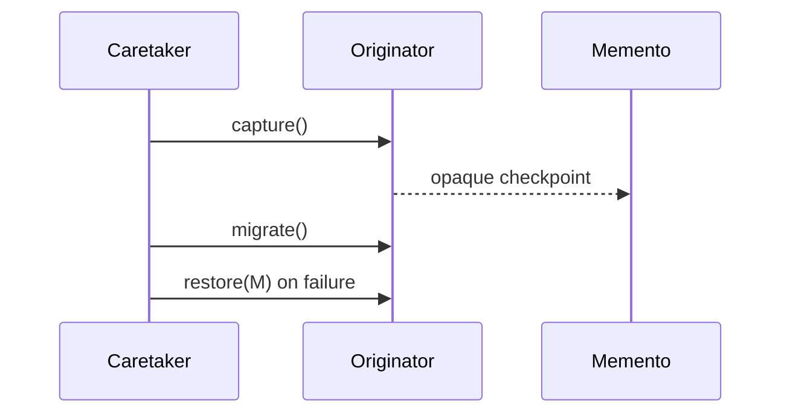

# 备忘录模式 / Memento

> **Scenario / 场景:** Configuration Migration / 配置迁移回滚

## 1. 先看问题 / The problem

A configuration migration may fail after modifying a file. The migration Skill
needs exact rollback, while the coordinator should not inspect or duplicate the
configuration's internal representation:

```text
migration -> partial write -> failure -> ???
```

## 2. 模式一句话 / Pattern in one sentence

**An Originator creates an opaque snapshot; a Caretaker stores it and asks the
Originator to restore it when needed.**



The Caretaker manages the checkpoint without reading its internal state.

## 3. 现实中的 Skill / Existing Skill case

**Case Skill:** [Microsoft SkillOpt staging](https://github.com/microsoft/SkillOpt/blob/b860a5cf88ce75e2bd02ca981ac21fb28cffba83/skillopt_sleep/staging.py). **Status: candidate correspondence.**

What the case does: a staging flow backs up a manifest before adopting a
candidate configuration.

```text
staging configuration -> backup manifest -> adopt candidate
```

The inspected path shows backup before adoption. A complete owned restore
protocol is not exposed in the frozen file.

## 4. 本仓库的 Mock Skill / Mock Skill

Our concrete example is `configuration-migration`:

```text
patterns/memento/sample/
├── SKILL.md                                  # migration coordinator
├── child-skills/
│   ├── originator/SKILL.md                    # owns configuration state
│   ├── memento/SKILL.md                       # opaque snapshot contract
│   └── caretaker/SKILL.md                     # stores checkpoint
├── references/configuration-memento-contract.md
├── scripts/run_demo.py
└── tests/test_demo.py
```

The important part of [`sample/SKILL.md`](sample/SKILL.md) is:

```markdown
<!-- Memento: capture and restore exact bytes without exposing config internals. -->
1. ask the Originator for one opaque snapshot
2. let the Caretaker hold the snapshot
3. attempt the migration
4. restore the snapshot on failure, then discard it
```

## 5. 角色对应 / Role mapping

| GoF role | Skillware carrier in this example |
| --- | --- |
| Originator | configuration migration Skill |
| Memento | opaque configuration checkpoint |
| Caretaker | migration coordinator and checkpoint holder |

## 6. 什么时候使用 / When to use

| Use Memento when | Keep it simple when |
| --- | --- |
| exact prior state must be restored without exposing internals | the state is already a small public value object |
| a coordinator must hold checkpoints safely | retrying the operation is sufficient |
| rollback must remain owned by the state holder | a durable transaction system already owns rollback |

## 7. 运行与验证 / Run and inspect

```bash
python3 sample/scripts/run_demo.py --fail
python3 -m unittest discover -s sample/tests -v
```

Read the [complete sample](sample/), [participant map](participant-map.yaml),
[definition](definition.md), and [misuse case](misuse/explanation.md).

## 8. 证据边界 / Evidence boundary

The local sample verifies exact-byte capture, rollback, and checkpoint disposal.
SkillOpt is candidate correspondence; the sample does not establish durable
distributed transactions or production filesystem guarantees.
