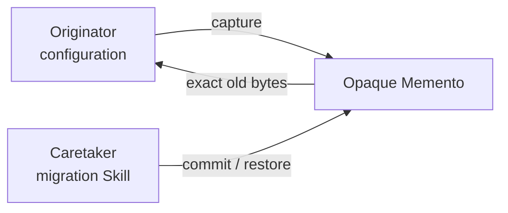

# Configuration Migration

> **This directory is the mock sample.** It demonstrates the Memento idea with
> configuration rollback; it is not the SkillOpt staging implementation.

## Evidence at a glance



| Evidence layer | Open this | What proves the Memento relation |
| --- | --- | --- |
| **Upstream case** | [SkillOpt `staging.py`](https://github.com/microsoft/SkillOpt/blob/b860a5cf88ce75e2bd02ca981ac21fb28cffba83/skillopt_sleep/staging.py) | Adoption creates a backup before changing a Skill configuration (candidate correspondence). |
| **Mock Originator/Caretaker** | [`SKILL.md#agent-mode`](SKILL.md#agent-mode) | The workflow captures before mutation and restores only after a write attempt fails. |
| **Memento contract** | [`child-skills/`](child-skills/) · [`references/configuration-memento-contract.md`](references/configuration-memento-contract.md) | Checkpoint bytes are opaque, owned, checksummed, and one-use. |
| **Executable proof** | [`scripts/run_demo.py`](scripts/run_demo.py) · [`tests/test_demo.py`](tests/test_demo.py) | `--fail` exercises exact-byte rollback and failed-restore reporting. |

**The pattern-bearing line is:** Originator state → opaque checkpoint →
Caretaker restore/discard decision.

## Mock Skill source

```text
sample/
├── SKILL.md
├── child-skills/{configuration-originator,migration-caretaker}/SKILL.md
├── references/configuration-memento-contract.md
├── scripts/run_demo.py
└── tests/test_demo.py
```

```markdown
<!-- Memento: the checkpoint is opaque to the Caretaker. -->
capture exact bytes -> prepare migration -> write atomically
  -> failure after write: restore checkpoint
  -> verified success: discard checkpoint
```

## Learn the pattern

| Before: rollback data is exposed to the workflow | After: capture an opaque Memento |
| --- | --- |
| `caretaker reads old_config`<br>`caretaker edits new_config`<br>`caretaker reconstructs old_config on failure`<br><br>The caretaker knows internal state and can lose exact bytes or permissions. | `Originator -> opaque checkpoint -> Caretaker chooses restore/discard`<br><br>The Originator owns state; the Caretaker owns checkpoint lifetime. |

### Use it when

| Use Memento when | Keep it simple when |
| --- | --- |
| exact prior state must be restored | only a semantic audit log is needed |
| the owner should hide internal state | a database already owns snapshots and restore |
| checkpoint lifecycle needs explicit failure rules | a normal versioned file is sufficient |

### Skill-author recipe

1. Let Originator create and validate the checkpoint.
2. Give Caretaker an opaque handle, never raw state.
3. Define when capture, restore, and discard occur.
4. Test stale, foreign, reused, and corrupted checkpoints.

## Scenario

A service configuration must move from version `n` to `n+1` atomically. If the
write or post-write validation fails, the exact prior bytes must be restorable;
if preparation fails before a write attempt, newer external content must be
preserved.

## Why this is Memento

The Originator owns configuration state, the Memento stores an opaque exact
checkpoint, and the Caretaker controls when to capture, restore, or discard it.
The Caretaker cannot inspect or forge the captured configuration.

| GoF role | Skillware carrier in this example |
| --- | --- |
| Originator | `configuration-originator` child Skill |
| Memento | Opaque `configuration-memento-v1` checkpoint |
| Caretaker | Root Configuration Migration and `migration-caretaker` |

## Contract

Input: one bounded JSON configuration file. Output: migration status, old/new
version, endpoint, and `restored`. Capture is opaque and one-use; checksum,
owner, target, and lifecycle checks reject stale or foreign checkpoints.

## Where to look

- [Root Skill](SKILL.md) defines preparation, write-attempt, restore, and discard phases.
- [Memento contract](references/configuration-memento-contract.md) defines opacity and admission checks.
- `scripts/run_demo.py --fail` exercises the rollback path without modifying repository fixtures.

Run the deterministic default demo without modifying its fixture:

```bash
python3 scripts/run_demo.py
```

Run a supplied file in place or exercise the rollback path:

```bash
python3 scripts/run_demo.py path/to/service.json
python3 scripts/run_demo.py path/to/service.json --fail
```

Run focused tests:

```bash
python3 -m unittest discover tests -v
```

The sample requires Python 3.10 or later, uses only the standard library, needs
no network or account, and imports no shared pattern code. It assumes one
trusted cooperative writer. Atomic replacement prevents partial file content;
it does not provide locking or identical crash guarantees on every filesystem.
Mode is applied to the open temporary file before file fsync and rename; a
portable path-based fallback is used only where descriptor mode is unavailable.
