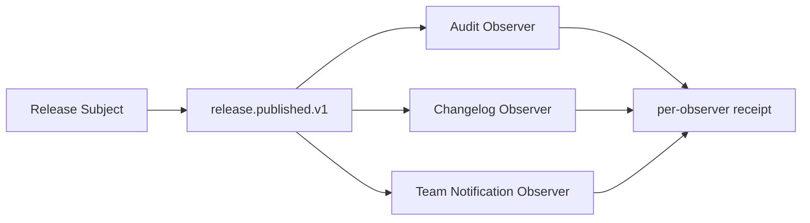

# 观察者模式 / Observer

> **Scenario / 场景:** Software Release Notification / 软件发布通知

## 1. 先看问题 / The problem

After a release, audit, changelog, and team-notification Skills all need the
same event. A direct chain makes the release Skill own every consumer and lets
one failing consumer block the others:

```text
release Skill -> audit -> changelog -> team notification
```

## 2. 模式一句话 / Pattern in one sentence

**A Subject publishes a typed event to independently registered Observer Skills
without embedding their responsibilities in the Subject.**



Observers can be registered, removed, and isolated from one another.

## 3. 现实中的 Skill / Existing Skill case

**Case Skill:** [Everything Claude Code lifecycle hooks](https://github.com/affaan-m/ECC/blob/2bc924faf2f8e893bfe0af86b1931283693c30ae/hooks/hooks.json) and the [continuous-learning observer hook](https://github.com/affaan-m/ECC/blob/2bc924faf2f8e893bfe0af86b1931283693c30ae/skills/continuous-learning-v2/hooks/observe.sh). **Status: candidate correspondence.**

What the case does: Host lifecycle events are routed to independent hook
consumers. The files show event routing, while complete Observer registration
and delivery semantics remain unverified.

```text
Host lifecycle event -> hook router -> observation Skill
```

## 4. 本仓库的 Mock Skill / Mock Skill

Our concrete example is `software-release-notification`:

```text
patterns/observer/sample/
├── SKILL.md                                  # Subject
├── child-skills/
│   ├── audit/SKILL.md                         # Observer 1
│   ├── changelog/SKILL.md                     # Observer 2
│   └── team-notification/SKILL.md             # Observer 3
├── references/release-event-contract.md
├── scripts/run_demo.py
└── tests/test_demo.py
```

The important part of [`sample/SKILL.md`](sample/SKILL.md) is:

```markdown
<!-- Observer: consumers register for one typed release event. -->
1. validate `release.published.v1`
2. freeze the active registration order
3. invoke each registered consumer once
4. record each receipt and isolate consumer failures
```

## 5. 角色对应 / Role mapping

| GoF role | Skillware carrier in this example |
| --- | --- |
| Subject | root release-notification Skill |
| Observer | audit, changelog, and team-notification Skills |
| ConcreteSubject | the published release event source |
| ConcreteObserver | each registered consumer implementation |

## 6. 什么时候使用 / When to use

| Use Observer when | Keep it simple when |
| --- | --- |
| new consumers should subscribe without editing the Subject | there is one fixed recipient |
| consumers need independent failure and lifecycle management | the event is only an internal function call |
| an explicit typed event contract can be shared | ordering and transaction coupling dominate |

## 7. 运行与验证 / Run and inspect

```bash
python3 sample/scripts/run_demo.py
python3 -m unittest discover -s sample/tests -v
```

Read the [complete sample](sample/), [participant map](participant-map.yaml),
[definition](definition.md), and [misuse case](misuse/explanation.md).

## 8. 证据边界 / Evidence boundary

The local sample verifies registration, publication order, receipts,
unsubscription, and failure isolation. The ECC paths remain candidate-level
correspondence and do not establish production delivery guarantees.
