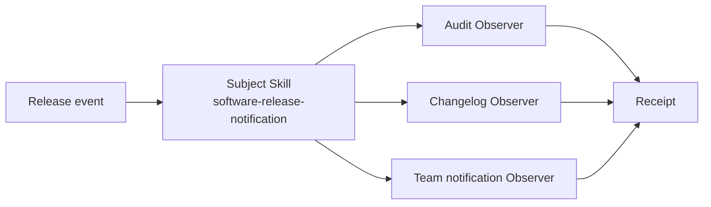

# Observer / 观察者模式

## 先看实际 Skill / Start here

**Case Skill（规范化片段）：**

```text
# upstream ECC behavior sketch
lifecycle event -> hook router -> observation Skill -> observation handler
```

**Mock Skill（本仓库）：**

```markdown
<!-- sample/SKILL.md: Subject owns registration and delivery. -->
register observers -> freeze order -> publish typed event
  -> audit / changelog / team-notification receipts
```

```text
sample/
├── SKILL.md
├── child-skills/{audit,changelog,team-notification}/SKILL.md
├── references/release-event-contract.md
└── tests/test_demo.py
```

## 一眼看懂 / At a glance

**一句话：** 一个事件源维护订阅者列表，把同一个事件通知给多个独立 Skill。



| | Case Skill（上游案例） | Mock sample（本仓库构造） |
| --- | --- | --- |
| **是哪一个** | [ECC continuous-learning-v2](https://github.com/affaan-m/ECC/blob/2bc924faf2f8e893bfe0af86b1931283693c30ae/skills/continuous-learning-v2/SKILL.md) + [hooks](https://github.com/affaan-m/ECC/blob/2bc924faf2f8e893bfe0af86b1931283693c30ae/hooks/hooks.json) | [`software-release-notification`](sample/SKILL.md) |
| **哪里体现模式** | lifecycle/tool event 被路由到 observation Skill（候选对应） | Subject 显式注册、按顺序通知三个 Observer，并记录 receipts |
| **怎么运行** | 由 Host lifecycle hook 触发 | `python3 sample/scripts/run_demo.py` |

**看哪三个文件：** `sample/SKILL.md`、`sample/child-skills/`、`sample/references/release-event-contract.md`。

## 直接看实现 / Direct evidence

### Case Skill：上游实现的关键行为

下面是根据固定版本 ECC hooks、`run-with-flags.js` 和 continuous-learning Skill 整理的**规范化行为片段**，不是上游原文复制：

```text
# normalized Case Skill behavior
hook event
  -> run-with-flags.js
  -> continuous-learning-v2 observation Skill
  -> observe.sh
```

模式信号：Host/lifecycle event 被发送给独立的观察处理 Skill。本案例的完整注册、注销和失败记账仍不可见。

### Mock sample：本仓库实际 Skill

```text
patterns/observer/sample/
├── SKILL.md                         # Subject + delivery policy
├── child-skills/
│   ├── audit/SKILL.md                # Observer 1
│   ├── changelog/SKILL.md            # Observer 2
│   └── team-notification/SKILL.md    # Observer 3
├── references/release-event-contract.md
└── scripts/run_demo.py               # registration + notification oracle
```

```markdown
<!-- Observer: Subject owns registration and notifies independent consumers. -->
## Agent mode

1. Validate the `release.published.v1` event.
2. Apply explicit `register` / `unregister` operations.
3. Freeze registration order when publication begins.
4. Invoke every active Observer once with an isolated event copy.
5. Record one receipt per attempt and continue after failures.
```

这段 mock Skill 直接对应 Observer 的核心：Subject 管订阅，Observer 各自处理，同一事件可独立交付。

This record transfers the canonical Gang of Four Observer pattern to
Skillware. The Subject is the ordered release subscription and event contract;
the root Software Release Notification Skill plus deterministic publisher is
the ConcreteSubject. Audit, changelog, and team-notification Skills are
ConcreteObservers implementing one `release-observer-v1` update operation.

The sample publishes a typed `release.published.v1` event after a successful
release. It supports explicit registration and unregistration, deterministic
registration-order delivery, isolated event copies, per-observer receipts,
failure isolation, and publication re-entry rejection.

- [English definition](definition.md)
- [中文定义](definition.zh-CN.md)
- [Participant map](participant-map.yaml)
- [Open-source correspondence](correspondence.md)
- [Runnable sample](sample/)
- [Misuse discriminator](misuse/explanation.md)

## Case Skill: upstream implementation

**Case Skill:** ECC's `skills/continuous-learning-v2/SKILL.md`, activated by
the lifecycle hook configuration.

The high-star comparison is [affaan-m/everything-claude-code](https://github.com/affaan-m/everything-claude-code):
`hooks/hooks.json` and `scripts/hooks/run-with-flags.js` route lifecycle/tool
events to the `skills/continuous-learning-v2/SKILL.md` observation workflow,
including `skills/continuous-learning-v2/hooks/observe.sh`. It is candidate-only
because registration and delivery accounting are not fully visible; see the
[pinned evidence record](../../docs/upstream-skill-evidence.md#observer--观察者模式).
The local sample supplies those contracts in [`sample/SKILL.md`](sample/SKILL.md).

## Mock sample Skill: this repository

**Mock Skill:** [`sample/SKILL.md`](sample/SKILL.md), named
`software-release-notification`. The root publishes one typed release event to
the `audit`, `changelog`, and `team-notification` child Skills.

The Observer idea is implemented by explicit registration, a frozen delivery
snapshot, isolated event copies, and per-observer receipts. Run
`python3 sample/scripts/run_demo.py`; the mapping is in
[`participant-map.yaml`](participant-map.yaml).

The local sample is **constructive** evidence. ECC hook artifacts are only a
**candidate correspondence** because pinned source shows event-to-handler
configuration and continuous-learning observation, but does not establish the
complete GoF registration, unregistration, deterministic delivery, and
failure-accounting relation. Neither claim establishes ecosystem frequency,
cross-Host equivalence, or comparative benefit.
