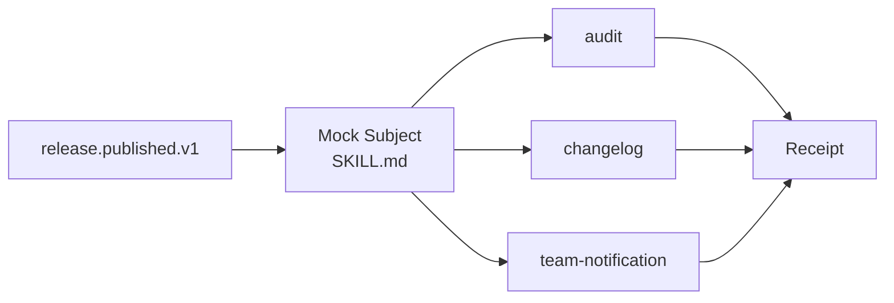

# Software Release Notification

> **This directory is the mock sample.** It demonstrates the Observer idea
> using release notifications; it is not the ECC hook implementation.

## Evidence at a glance



| Evidence layer | Open this | What proves the Observer relation |
| --- | --- | --- |
| **Upstream case** | [ECC continuous-learning-v2](https://github.com/affaan-m/ECC/blob/2bc924faf2f8e893bfe0af86b1931283693c30ae/skills/continuous-learning-v2/SKILL.md) + [hooks](https://github.com/affaan-m/ECC/blob/2bc924faf2f8e893bfe0af86b1931283693c30ae/hooks/hooks.json) | Lifecycle events are routed to an observation Skill (candidate correspondence). |
| **Mock Subject** | [`SKILL.md#agent-mode`](SKILL.md#agent-mode) | The root owns registration, order, event copies, and delivery accounting. |
| **Observer Skills** | [`child-skills/`](child-skills/) · [`references/release-event-contract.md`](references/release-event-contract.md) | Each consumer accepts the same event and returns an isolated receipt. |
| **Executable proof** | [`scripts/run_demo.py`](scripts/run_demo.py) · [`tests/test_demo.py`](tests/test_demo.py) | Tests cover registration, unregistration, failure isolation, and re-entry. |

**The pattern-bearing line is:** one Subject event → registered independent
Observers → one delivery receipt per Observer.

## Mock Skill source

```text
sample/
├── SKILL.md
├── child-skills/{audit,changelog,team-notification}/SKILL.md
├── references/release-event-contract.md
├── scripts/run_demo.py
└── tests/test_demo.py
```

```markdown
<!-- Observer: Subject owns subscriptions; consumers remain independent. -->
register observers -> freeze order -> publish release.published.v1
  -> audit receipt
  -> changelog receipt
  -> team-notification receipt
```

## Scenario

After version `1.2.0` is published, audit, changelog, and team-notification
consumers must receive the same release facts. Consumers may be registered or
unregistered without changing the publisher's core workflow.

## Why this is Observer

The release publisher is the Subject. It owns registration, freezes delivery
order, sends one typed event to each independent consumer, and records isolated
receipts. The consumer Skills never call one another.

| GoF role | Skillware carrier in this example |
| --- | --- |
| Subject / ConcreteSubject | Root `sample/SKILL.md` and `ReleaseSubject` oracle |
| Observer | `release-observer-v1` in `references/release-event-contract.md` |
| ConcreteObserver | `audit`, `changelog`, and `team-notification` child Skills |

## Contract

Input: a successful `release.published.v1` event plus explicit registration
operations. Output: the event, ordered delivery receipts, and summary counts.
Duplicate registration, unknown unregistration, nested publication, and silent
retry are rejected.

## Where to look

- [Root Skill](SKILL.md) defines registration and delivery policy.
- [Event contract](references/release-event-contract.md) defines the shared Observer interface.
- `scripts/run_demo.py` demonstrates order, failure isolation, and re-entry protection.

This standalone Observer sample publishes one typed software release event to
explicitly registered audit, changelog, and team-notification consumer Skills.

Run the default valid workflow from this directory:

```bash
python3 scripts/run_demo.py
```

Run the fixture that unregisters changelog before publication:

```bash
python3 scripts/run_demo.py fixtures/valid/release-after-unregistration.json
```

Run the focused tests:

```bash
python3 -m unittest discover tests -v
```

The demo requires Python 3.10 or newer, uses only the standard library, needs
no network or external accounts, and imports no shared pattern code. Three
deterministic update functions model separately inspectable child Skills;
Python does not load or interpret `SKILL.md`.

The Subject applies explicit registration operations, freezes insertion order
for delivery, gives each Observer an isolated event copy, records every attempt,
continues after failure, and rejects publication re-entry. Notification is not
transaction completion and this sample performs no implicit retry.
