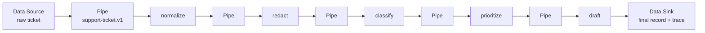

# Pipes and Filters / 管道-过滤器模式

## 先看实际 Skill / Start here

**Case Skill（规范化片段）：**

```text
# normalized OpenMontage behavior
pipeline manifest -> ordered stage Skills -> stage artifacts
loader validates the manifest and materializes the stage sequence
```

**Mock Skill（本仓库）：**

```markdown
<!-- sample/SKILL.md: every Filter consumes and returns support-ticket.v1. -->
normalize -> redact -> classify -> prioritize -> draft
Each boundary validates and deep-copies the record before the next Filter.
```

```text
sample/
├── SKILL.md
├── references/support-ticket-record-contract.md
├── scripts/run_demo.py
├── fixtures/
└── tests/test_demo.py
```

## 一眼看懂 / At a glance

**一句话：** 一个有版本的记录依次经过多个可替换 Filter，每个阶段通过显式 Pipe 交接。



| | Case Skill（上游案例） | Mock sample（本仓库构造） |
| --- | --- | --- |
| **是哪一个** | [OpenMontage animated-explainer pipeline](https://github.com/calesthio/OpenMontage/blob/db91727598d08d40919d7d68a47864a5467bd448/pipeline_defs/animated-explainer.yaml) + [pipeline loader](https://github.com/calesthio/OpenMontage/blob/db91727598d08d40919d7d68a47864a5467bd448/lib/pipeline_loader.py) | [`support-ticket-triage`](sample/SKILL.md) |
| **哪里体现模式** | manifest 声明顺序化 stage Skills，loader 读取并物化管线 | 五个 Filter 共享 `support-ticket.v1`，Pipe 在每个边界校验并复制记录 |
| **怎么运行** | 由 OpenMontage pipeline loader 驱动 | `python3 sample/scripts/run_demo.py` |

**看哪三个文件：** `sample/SKILL.md`、`sample/references/support-ticket-record-contract.md`、`sample/scripts/run_demo.py`。

## 直接看实现 / Direct evidence

### Case Skill：上游实现的关键行为

下面是根据固定版本的 manifest、loader 和 stage Skill 路径整理的规范化片段，用来标出模式信号：

```text
load animated-explainer.yaml
for stage in declared order:
  resolve the stage Skill
  pass the produced artifact to the next stage
```

证据状态保持为 **candidate correspondence**：公开文件显示了顺序化阶段和产物流，完整共享记录契约与运行时隔离仍需进一步验证。

### Mock sample：本仓库实际 Skill

```markdown
<!-- Pipes and Filters: the runner owns order; Filters own one transformation. -->
## Agent mode
1. Admit one bounded ticket and create `support-ticket.v1`.
2. Run `normalize`, `redact`, `classify`, `prioritize`, `draft` in order.
3. Validate and deep-copy the record before and after every Filter.
4. Stop at the first invalid result and identify its stage.
```

这段 Skill 直接对应 Data Source、Filter、Pipe 和 Data Sink 四个角色。

## Pattern record

This standalone record transfers the Pattern-Oriented Software Architecture
Pipes and Filters pattern to a Support Ticket Triage Skillware Unit. The local
sample contains five independently addressable Filters and a versioned record
contract; it does not claim GoF status.

- [English definition](definition.md)
- [中文定义](definition.zh-CN.md)
- [Participant map](participant-map.yaml)
- [Open-source correspondence](correspondence.md)
- [Runnable sample](sample/)
- [Misuse discriminator](misuse/explanation.md)

## Case Skill: upstream implementation

**Case Skill:** OpenMontage's `animated-explainer.yaml` and its pipeline loader.
The pinned files show a declared stage sequence and stage Skill resolution;
the evidence record explains why the claim remains candidate-level.

## Mock sample Skill: this repository

**Mock Skill:** [`sample/SKILL.md`](sample/SKILL.md), named
`support-ticket-triage`. It demonstrates ordered, replaceable Filters with
strict boundary contracts. Run `python3 sample/scripts/run_demo.py` and inspect
the focused tests under [`sample/tests/`](sample/tests/).

## Learn the pattern

| Use Pipes and Filters when | Keep it simple when |
| --- | --- |
| stages have a stable shared record and need independent replacement | the work is one indivisible operation |
| order, validation, and failure attribution should be explicit | stages need rich cyclic collaboration |

The decisive check is independent stage ownership plus an explicit boundary
contract. A monolithic function with five headings does not provide that check.
