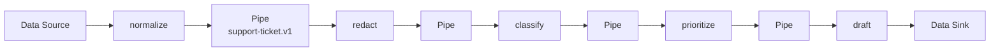

# 管道-过滤器模式 / Pipes and Filters

> **Scenario / 场景:** Support Ticket Triage / 客服工单分流

## 1. 先看问题 / The problem

A ticket needs normalization, redaction, classification, prioritization, and
drafting. A single triage Skill makes stages hard to replace and gives no clear
boundary for invalid intermediate data:

```text
caller -> one large triage Skill
```

## 2. 模式一句话 / Pattern in one sentence

**Pass one versioned record through independently replaceable Filters connected
by explicit Pipes.**



## 3. 现实中的 Skill / Existing Skill case

**Case Skill:** [OpenMontage animated-explainer pipeline](https://github.com/calesthio/OpenMontage/blob/db91727598d08d40919d7d68a47864a5467bd448/pipeline_defs/animated-explainer.yaml) and its [pipeline loader](https://github.com/calesthio/OpenMontage/blob/db91727598d08d40919d7d68a47864a5467bd448/lib/pipeline_loader.py). **Status: candidate correspondence.**

What the case does: a manifest declares ordered stage Skills and the loader
passes produced artifacts through that order.

```text
manifest -> stage Skill 1 -> stage Skill 2 -> stage Skill 3 -> artifact
```

The source shows ordered stages and artifact flow. A complete shared Pipe
contract remains unverified.

## 4. 本仓库的 Mock Skill / Mock Skill

Our concrete example is `support-ticket-triage`:

```text
patterns/pipes-and-filters/sample/
├── SKILL.md                                  # runner and pipeline contract
├── references/support-ticket-record-contract.md
├── scripts/run_demo.py
├── fixtures/valid/urgent-access.json
└── tests/test_demo.py
```

The important part of [`sample/SKILL.md`](sample/SKILL.md) is:

```markdown
<!-- Pipes and Filters: the runner owns order; each Filter owns one transform. -->
normalize -> redact -> classify -> prioritize -> draft
Validate and deep-copy `support-ticket.v1` before and after every Filter.
Stop at the first invalid result and identify its stage.
```

## 5. 角色对应 / Role mapping

| POSA role | Skillware carrier in this example |
| --- | --- |
| Data Source | ticket admission and record creation |
| Filter | five transformation Skills |
| Pipe | `support-ticket.v1` validation/copy boundary |
| Data Sink | final record and canonical trace |

## 6. 什么时候使用 / When to use

| Use Pipes and Filters when | Keep it simple when |
| --- | --- |
| stages share a stable record and need independent replacement | the work is one indivisible operation |
| order and failure attribution should be explicit | stages need rich cyclic collaboration |
| each boundary can validate the same contract | boundary copying costs more than isolation helps |

## 7. 运行与验证 / Run and inspect

```bash
python3 sample/scripts/run_demo.py
python3 -m unittest discover -s sample/tests -v
```

Read the [complete sample](sample/), [participant map](participant-map.yaml),
[definition](definition.md), and [misuse case](misuse/explanation.md).

## 8. 证据边界 / Evidence boundary

The local sample verifies five replaceable Filters, explicit boundaries, and
fail-stop behavior. OpenMontage remains candidate correspondence; the local
oracle does not establish distributed buffering, backpressure, or runtime
equivalence.
