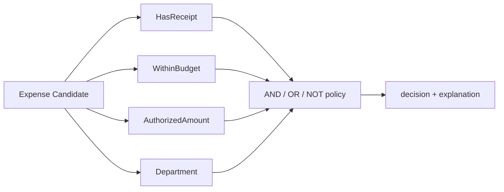

# 规约模式 / Specification

> **Scenario / 场景:** Expense Approval Policy / 费用审批规则

## 1. 先看问题 / The problem

Expense approval contains reusable rules for receipts, budgets, authority, and
departments. One opaque function hides rule names and makes policy changes hard
to explain:

```text
caller -> eligible(expense)
           all policy decisions hidden inside one function
```

## 2. 模式一句话 / Pattern in one sentence

**Represent each domain rule as a named Specification that can be evaluated and
combined through one shared interface.**



## 3. 现实中的 Skill / Existing Skill case

**Case Skill:** no public upstream Skill is admitted for this record. **Status:
not observable.**

This explicit status keeps the pattern definition separate from ecosystem
evidence. The repository does not invent an external case for Specification.

## 4. 本仓库的 Mock Skill / Mock Skill

Our constructive example is `expense-approval-policy`:

```text
patterns/specification/sample/
├── SKILL.md                                  # policy composition
├── child-skills/
│   ├── has-receipt/SKILL.md                   # leaf Specification
│   ├── within-budget/SKILL.md
│   ├── authorized-amount/SKILL.md
│   └── department/SKILL.md
├── references/expense-candidate-contract.md
├── scripts/run_demo.py
└── tests/test_demo.py
```

The important part of [`sample/SKILL.md`](sample/SKILL.md) is:

```markdown
<!-- Specification: every rule shares boolean and explanation behavior. -->
HasReceipt() & WithinBudget() & AuthorizedAmount(1000) & ~Department("restricted")

Validate the Candidate first, then evaluate the named rules left-to-right.
Return the decision together with a structured explanation trace.
```

## 5. 角色对应 / Role mapping

| DDD role | Skillware carrier in this example |
| --- | --- |
| Candidate | bounded expense mapping |
| Specification | each named leaf rule Skill |
| Composite Specification | `AND`, `OR`, and `NOT` policy nodes |

## 6. 什么时候使用 / When to use

| Use Specification when | Keep it simple when |
| --- | --- |
| rules need names, reuse, composition, tests, or explanations | one trivial check has no reuse need |
| policy decisions operate on a bounded Candidate | the operation is state-changing or procedural |
| policy authors need AND/OR/NOT combinations | no stable decision contract can be defined |

## 7. 运行与验证 / Run and inspect

```bash
python3 sample/scripts/run_demo.py
python3 -m unittest discover -s sample/tests -v
```

Read the [complete sample](sample/), [participant map](participant-map.yaml),
[definition](definition.md), and [misuse case](misuse/explanation.md).

## 8. 证据边界 / Evidence boundary

The local sample is constructive evidence for named, composable rules and
explanations. No external Specification case was admitted, so ecosystem
correspondence remains not observable.
