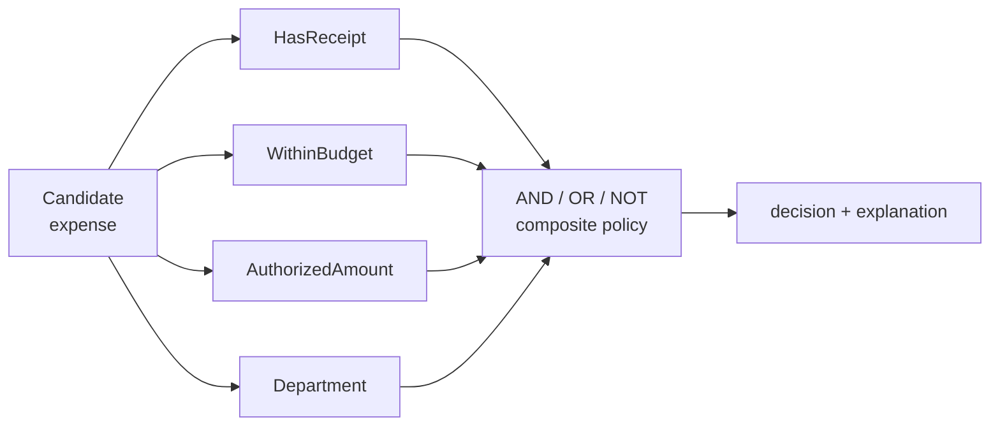

# Specification / 规约模式

## 先看实际 Skill / Start here

**Case Skill（上游状态）：**

```text
No public upstream Skill is admitted as a bounded Specification case
in this release. The controlled status is: not observable.
```

**Mock Skill（本仓库）：**

```markdown
<!-- sample/SKILL.md: named rules keep the policy composable and explainable. -->
HasReceipt() & WithinBudget() & AuthorizedAmount(1000) & ~Department("restricted")
The same Candidate contract is used by every leaf and composite rule.
```

```text
sample/
├── SKILL.md
├── child-skills/{has-receipt,within-budget,authorized-amount,department}/SKILL.md
├── references/expense-candidate-contract.md
├── scripts/run_demo.py
└── tests/test_demo.py
```

## 一眼看懂 / At a glance

**一句话：** 把领域判断写成可命名、可复用、可组合并能解释的规则。



| | Case Skill（上游案例） | Mock sample（本仓库构造） |
| --- | --- | --- |
| **是哪一个** | 本 release 没有纳入可验证的公开 Skill 案例 | [`expense-approval-policy`](sample/SKILL.md) |
| **哪里体现模式** | 外部对应关系状态为 `not observable` | 四个具名叶子规则通过 AND/OR/NOT 组合，并返回结构化解释 |
| **怎么运行** | 无可复现的外部运行入口 | `python3 sample/scripts/run_demo.py` |

**看哪三个文件：** `sample/SKILL.md`、`sample/child-skills/`、`sample/references/expense-candidate-contract.md`。

## 直接看实现 / Direct evidence

### Case Skill：外部证据边界

```text
# controlled evidence status
upstream Specification Skill: not observable
external implementation: none admitted
```

这个空位是有意保留的，读者可以清楚区分“模式定义”和“生态证据”。本仓库不为 Specification 虚构高星项目案例。

### Mock sample：本仓库实际 Skill

```markdown
<!-- Specification: each rule shares is_satisfied_by(Candidate). -->
## Agent mode
1. Validate the exact Candidate fields required by the policy.
2. Compose registered rules with `AND`, `OR`, and `NOT`.
3. Evaluate left-to-right with deterministic short-circuit semantics.
4. Return the boolean decision and a structured explanation trace.
```

这段 Skill 直接对应 Specification、Candidate 和 Composite Specification 三类角色。

## Pattern record

This standalone record transfers Eric Evans's Domain-Driven Design
Specification pattern to an Expense Approval Policy Skillware Unit. It is a
domain pattern outside the GoF catalog. The local sample is constructive
evidence; the external correspondence status remains **not observable**.

- [English definition](definition.md)
- [中文定义](definition.zh-CN.md)
- [Participant map](participant-map.yaml)
- [Open-source correspondence](correspondence.md)
- [Runnable sample](sample/)
- [Misuse discriminator](misuse/explanation.md)

## Case Skill: upstream implementation

No public upstream Skill was admitted for this record. The absence is recorded
in [`correspondence.md`](correspondence.md) so future evidence can be added
without changing the local sample's claim.

## Mock sample Skill: this repository

**Mock Skill:** [`sample/SKILL.md`](sample/SKILL.md), named
`expense-approval-policy`. It defines reusable receipt, budget, authority, and
department rules over one bounded Candidate contract. Run
`python3 sample/scripts/run_demo.py` and inspect the focused tests under
[`sample/tests/`](sample/tests/).

## Learn the pattern

| Use Specification when | Keep it simple when |
| --- | --- |
| rules need names, reuse, composition, tests, or explanations | one trivial check has no reuse need |
| policy decisions operate on a bounded Candidate contract | the operation is state-changing or inherently procedural |

The decisive check is that each rule can be named, combined, evaluated, and
explained through a shared interface. One opaque `eligible(expense)` function
does not provide that structure.
