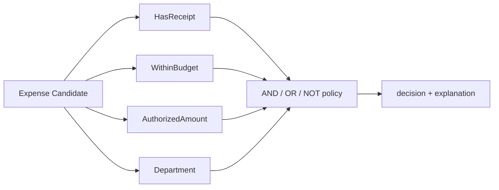

# Expense Approval Policy

> **This directory is the mock sample.** It demonstrates Eric Evans's Domain-
> Driven Design Specification pattern in Skillware. The record is outside the
> GoF catalog and has no admitted external Skill case in this release.

## Evidence at a glance



| Evidence layer | Open this | What proves the Specification relation |
| --- | --- | --- |
| **Upstream case Skill** | No admitted public case; see [`../correspondence.md`](../correspondence.md) | The controlled status is `not observable`, with no invented ecosystem claim. |
| **Mock root Skill** | [`SKILL.md#agent-mode`](SKILL.md#agent-mode) | One policy composes named rules over one exact Candidate contract. |
| **Leaf Skills** | [`child-skills/`](child-skills/) | Receipt, budget, authority, and department rules are independently named. |
| **Executable proof** | [`scripts/run_demo.py`](scripts/run_demo.py) · [`tests/test_demo.py`](tests/test_demo.py) | Tests verify composition, short-circuit semantics, explanations, and validation. |

**The pattern-bearing line is:** Candidate → named leaf Specifications →
AND/OR/NOT composite → decision and explanation. The local implementation is
constructive evidence and does not stand in for external correspondence.

## Mock Skill source

```text
sample/
├── SKILL.md
├── child-skills/{has-receipt,within-budget,authorized-amount,department}/SKILL.md
├── references/expense-candidate-contract.md
├── scripts/run_demo.py
└── tests/test_demo.py
```

```markdown
<!-- Specification: every rule shares a boolean and explanation contract. -->
## Policy
HasReceipt() & WithinBudget() & AuthorizedAmount(1000) & ~Department("restricted")

## Evaluation
Validate the exact Candidate fields, evaluate left-to-right, and retain a
structured explanation trace without mutating the Candidate.
```

## Learn the pattern

### Before: one opaque eligibility function

```text
caller -> eligible(expense)
           receipt + budget + authority + department rules hidden inside
```

The caller cannot name, reuse, combine, or explain one rule independently.

### After: named composable Specifications

```text
caller -> expense-approval-policy
           -> HasReceipt & WithinBudget & AuthorizedAmount & NOT Department
           -> decision + explanation trace
```

### Use it when

| Use Specification when | Keep it simple when |
| --- | --- |
| domain rules need names, reuse, composition, tests, or explanations | one trivial check has no reuse need |
| every rule can share a bounded Candidate contract | the operation is state-changing or inherently procedural |
| policy authors need AND/OR/NOT combinations | the rule cannot be expressed as a stable decision over input data |

### Skill-author recipe

1. Define the Candidate schema and the boolean/explanation contract.
2. Give each domain rule one name and one responsibility.
3. Compose only registered leaf and composite Skills.
4. Test truth tables, short-circuit order, explanations, and invalid input.

## Scenario

An expense review Skill evaluates a claim with a receipt, budget, amount, and
department. The default policy approves claims that have a receipt, stay within
budget, stay below the authorized amount, and do not belong to `restricted`.

## Why this is Specification

| DDD role | Skillware carrier in this example |
| --- | --- |
| Candidate | bounded expense mapping under `expense-candidate-v1` |
| Specification | named leaf Skill such as `HasReceipt` or `WithinBudget` |
| Composite Specification | `AND`, `OR`, and `NOT` policy nodes |

## Contract and run commands

Input fields are `receipt`, `budget`, `amount`, and `department`. The CLI emits
an ASCII-safe decision and explanation trace. Missing, extra, malformed, or
unbounded fields are rejected before rule evaluation.

From this directory, run the default fixture:

```bash
python3 scripts/run_demo.py
```

Run a focused test suite:

```bash
python3 -m unittest discover tests -v
```

The sample uses only the Python standard library and no network or credentials.
It demonstrates deterministic policy construction; it does not establish
production authorization, persistence-query translation, or external
ecosystem prevalence.
