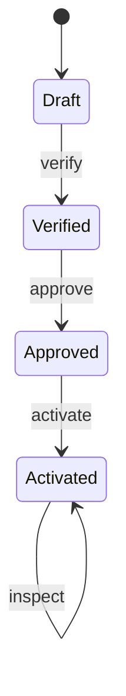

# State / 状态模式

## 一眼看懂 / At a glance

**一句话：** 当前状态决定当前动作和下一个状态；状态 Skill 自己拥有这段行为。



| | Case Skill（上游案例） | Mock sample（本仓库构造） |
| --- | --- | --- |
| **是哪一个** | [OpenMontage checkpoint protocol](https://github.com/calesthio/OpenMontage/blob/db91727598d08d40919d7d68a47864a5467bd448/skills/meta/checkpoint-protocol.md) + [checkpoint.py](https://github.com/calesthio/OpenMontage/blob/db91727598d08d40919d7d68a47864a5467bd448/lib/checkpoint.py) | [`vendor-onboarding-workflow`](sample/SKILL.md) |
| **哪里体现模式** | 持久 checkpoint status 控制 resume 行为（候选对应） | Context 重载状态并委托给 draft/verified/approved/activated Skill |
| **怎么运行** | 由 OpenMontage checkpoint protocol 驱动 | `python3 sample/scripts/run_demo.py` |

**看哪三个文件：** `sample/SKILL.md`、`sample/child-skills/`、`sample/references/vendor-state-contract.md`。

## 直接看实现 / Direct evidence

### Case Skill：上游实现的关键行为

下面是根据固定版本 OpenMontage checkpoint protocol 和 `checkpoint.py` 整理的**规范化行为片段**，不是上游原文复制：

```text
# normalized Case Skill behavior
checkpoint.status = current_stage
resume:
  read checkpoint.status
  continue from the persisted stage
```

模式信号：持久状态决定下一步行为。本案例没有充分证明独立 ConcreteState Skill，因此保持 candidate correspondence。

### Mock sample：本仓库实际 Skill

```text
patterns/state/sample/
├── SKILL.md                         # Context: reload + persist
├── child-skills/
│   ├── draft/SKILL.md                # ConcreteState
│   ├── verified/SKILL.md             # ConcreteState
│   ├── approved/SKILL.md             # ConcreteState
│   └── activated/SKILL.md            # ConcreteState
├── references/vendor-state-contract.md
└── scripts/run_demo.py               # persistence + recovery oracle
```

```markdown
<!-- State: each state owns its legal action and successor. -->
## Agent mode

1. Load the persisted state before every action.
2. Invoke only the Skill named by that state.
3. Let that ConcreteState accept or reject the action.
4. Atomically persist the successor before reporting success.
```

这段 mock Skill 直接对应 State 的核心：状态决定行为，状态对象拥有转换，Context 负责持久化和恢复。

This record transfers the canonical Gang of Four State pattern to Skillware
through a Vendor Onboarding Workflow / 供应商准入流程. The persisted workflow is
the Context, `vendor-onboarding-state-v1` is the State contract, and four child
Skills are ConcreteStates for draft, verified, approved, and activated.

Each ConcreteState owns its permitted action and successor. The Context reloads
persisted state before delegation and atomically commits only a legal result:
`draft --verify--> verified --approve--> approved --activate--> activated`.

- [English definition](definition.md)
- [中文定义](definition.zh-CN.md)
- [Participant map](participant-map.yaml)
- [Correspondence assessment](correspondence.md)
- [Runnable sample](sample/)
- [Misuse discriminator](misuse/explanation.md)

## Case Skill: upstream implementation

**Case Skill:** OpenMontage's checkpoint protocol at
`skills/meta/checkpoint-protocol.md`, persisted by `lib/checkpoint.py`.

The high-star comparison is [calesthio/OpenMontage](https://github.com/calesthio/OpenMontage):
`lib/checkpoint.py` persists stage status described by
`skills/meta/checkpoint-protocol.md` and
`schemas/checkpoints/checkpoint.schema.json`, with lifecycle guidance in
`AGENT_GUIDE.md`. This is candidate correspondence rather than a complete GoF
State claim; the frozen paths and limits are in the [evidence record](../../docs/upstream-skill-evidence.md#state--状态模式).
The local sample supplies explicit ConcreteState Skills and restart recovery.

## Mock sample Skill: this repository

**Mock Skill:** [`sample/SKILL.md`](sample/SKILL.md), named
`vendor-onboarding-workflow`. It reloads the current vendor state and invokes
one of the `draft`, `verified`, `approved`, or `activated` child Skills.

The State idea is implemented by state-owned legal actions and successors,
with atomic persistence after a successful transition. Run
`python3 sample/scripts/run_demo.py`; the mapping is in
[`participant-map.yaml`](participant-map.yaml).

The local sample is **constructive** evidence. OpenMontage checkpoint behavior
is a **candidate correspondence** at one fixed public revision: persisted
checkpoint status controls resume and next-stage behavior, but the reviewed
paths do not establish the complete GoF participant relation. Neither claim
establishes ecosystem frequency, production reliability, cross-Host
equivalence, or comparative benefit.
