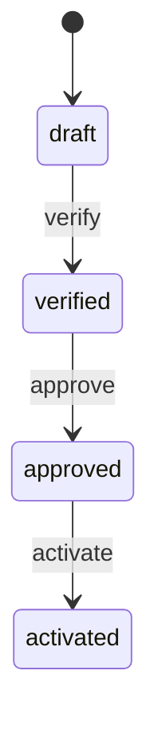

# 状态模式 / State

> **Scenario / 场景:** Vendor Onboarding Workflow / 供应商准入流程

## 1. 先看问题 / The problem

A vendor can be verified only after it is drafted, approved only after
verification, and activated only after approval. A single root Skill full of
conditionals grows as states and legal actions are added:

```text
if state == draft: ...
elif state == verified: ...
elif state == approved: ...
```

## 2. 模式一句话 / Pattern in one sentence

**The current persisted state owns the legal action and transition for the
Context.**



The root Context recovers the state and delegates the next action to its
ConcreteState Skill.

## 3. 现实中的 Skill / Existing Skill case

**Case Skill:** [OpenMontage checkpoint protocol](https://github.com/calesthio/OpenMontage/blob/db91727598d08d40919d7d68a47864a5467bd448/skills/meta/checkpoint-protocol.md) and [checkpoint implementation](https://github.com/calesthio/OpenMontage/blob/db91727598d08d40919d7d68a47864a5467bd448/lib/checkpoint.py). **Status: candidate correspondence.**

What the case does: checkpoint data persists stage/status information so later
work can resume from a recovered point.

```text
load checkpoint -> recover current stage -> continue permitted work
```

The files show persisted checkpoint behavior. Complete GoF State delegation is
not established at the frozen paths.

## 4. 本仓库的 Mock Skill / Mock Skill

Our concrete example is `vendor-onboarding-workflow`:

```text
patterns/state/sample/
├── SKILL.md                                  # Context
├── child-skills/
│   ├── draft/SKILL.md                         # ConcreteState
│   ├── verified/SKILL.md
│   ├── approved/SKILL.md
│   └── activated/SKILL.md
├── references/vendor-state-contract.md
├── scripts/run_demo.py
└── tests/test_demo.py
```

The important part of [`sample/SKILL.md`](sample/SKILL.md) is:

```markdown
<!-- State: persisted state selects the only legal action. -->
1. load the vendor's current state and revision
2. invoke the Skill named by that state
3. accept only the state's legal action
4. persist the successor state atomically
```

## 5. 角色对应 / Role mapping

| GoF role | Skillware carrier in this example |
| --- | --- |
| Context | root onboarding Skill plus persisted record |
| State | shared state interface and state contract |
| ConcreteState | `draft`, `verified`, `approved`, `activated` Skills |

## 6. 什么时候使用 / When to use

| Use State when | Keep it simple when |
| --- | --- |
| legal actions and transitions depend on recovered state | there are only two branches with no lifecycle |
| each state owns distinct behavior | the root operation is a fixed sequence |
| state needs independent testing and persistence | state has no effect on allowed behavior |

## 7. 运行与验证 / Run and inspect

```bash
python3 sample/scripts/run_demo.py
python3 -m unittest discover -s sample/tests -v
```

Read the [complete sample](sample/), [participant map](participant-map.yaml),
[definition](definition.md), and [misuse case](misuse/explanation.md).

## 8. 证据边界 / Evidence boundary

The local sample verifies legal transitions, persistence, recovery, and
revision checks. OpenMontage is candidate correspondence; the sample does not
establish cross-Host state durability or production transaction guarantees.
