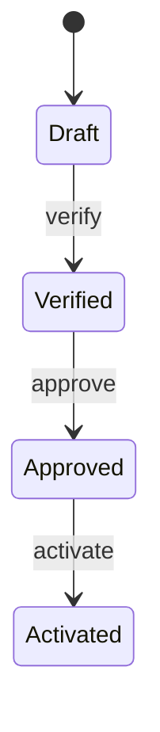

# Vendor Onboarding Workflow

> **This directory is the mock sample.** It demonstrates the State idea with
> vendor onboarding; it is not the OpenMontage checkpoint implementation.

## Evidence at a glance



| Evidence layer | Open this | What proves the State relation |
| --- | --- | --- |
| **Upstream case** | [OpenMontage checkpoint protocol](https://github.com/calesthio/OpenMontage/blob/db91727598d08d40919d7d68a47864a5467bd448/skills/meta/checkpoint-protocol.md) + [checkpoint.py](https://github.com/calesthio/OpenMontage/blob/db91727598d08d40919d7d68a47864a5467bd448/lib/checkpoint.py) | Persisted stage status controls resume behavior (candidate correspondence). |
| **Mock Context** | [`SKILL.md#agent-mode`](SKILL.md#agent-mode) | The workflow reloads state and delegates the action to the current State. |
| **ConcreteState Skills** | [`child-skills/`](child-skills/) · [`references/vendor-state-contract.md`](references/vendor-state-contract.md) | Each state owns legal actions and successors. |
| **Executable proof** | [`scripts/run_demo.py`](scripts/run_demo.py) · [`tests/test_demo.py`](tests/test_demo.py) | Tests cover illegal transitions, atomic persistence, and restart recovery. |

**The pattern-bearing line is:** persisted current state → state-owned action →
persisted successor state.

## Mock Skill source

```text
sample/
├── SKILL.md
├── child-skills/{draft,verified,approved,activated}/SKILL.md
├── references/vendor-state-contract.md
├── scripts/run_demo.py
└── tests/test_demo.py
```

```markdown
<!-- State: the current child Skill owns the legal transition. -->
load persisted state -> invoke current state's action
  -> reject illegal action
  -> atomically persist successor on success
```

## Learn the pattern

### Before: one root Skill grows a state switch

```text
if state == "draft": verify()
elif state == "verified": approve()
elif state == "approved": activate()
```

The root accumulates every state-specific rule and becomes the only place that
can be changed safely.

### After: the current State Skill owns its behavior

```text
persisted state -> current State Skill -> legal action + successor
```

### Use it when

| Use State when | Keep it simple when |
| --- | --- |
| the same action changes meaning by lifecycle state | state is only display metadata |
| transitions and illegal actions need ownership | a small immutable enum is enough |
| state must survive restart | a workflow engine already owns transitions |

### Skill-author recipe

1. Define the State contract and legal actions.
2. Give each ConcreteState its own transition behavior.
3. Make Context load state before every action.
4. Persist a successful successor before reporting success.

## Scenario

A vendor moves through `draft`, `verified`, `approved`, and `activated`. The
same action, such as `approve`, means different things depending on the
persisted state, and the workflow must recover correctly after a restart.

## Why this is State

The Context reloads the current state before every action and delegates the
action to the corresponding ConcreteState Skill. Each state owns its legal
action and successor; the Context does not grow a centralized phase switch.

| GoF role | Skillware carrier in this example |
| --- | --- |
| Context | Root `sample/SKILL.md` and persisted workflow |
| State | `vendor-onboarding-state-v1` in `references/vendor-state-contract.md` |
| ConcreteState | `draft`, `verified`, `approved`, and `activated` child Skills |

## Contract

Input: vendor identity, persisted state record, and one requested action.
Output: ordered transition results plus final and recovered state. Illegal
actions and corrupted records fail without silently recreating `draft`.

## Where to look

- [Root Skill](SKILL.md) defines reload, delegation, and atomic persistence.
- [State contract](references/vendor-state-contract.md) defines `handle-action`.
- `scripts/run_demo.py` and `fixtures/valid/recover-approved.json` show restart recovery.

Run the default full workflow from this directory:

```bash
python3 scripts/run_demo.py
```

Run the restart-recovery fixture:

```bash
python3 scripts/run_demo.py fixtures/valid/recover-approved.json
```

Run the focused tests:

```bash
python3 -m unittest discover tests -v
```

The demo requires Python 3.10 or newer, uses only the standard library, needs
no network or external accounts, and imports no shared pattern code. The four
Python classes model separately inspectable ConcreteState Skills; Python does
not load or interpret `SKILL.md`.

Writes use an atomic same-directory replacement, and memory advances only after
that replacement succeeds. The sample is single-writer: atomic replacement is
not a substitute for cross-process concurrency control. Initial construction is
the explicit bootstrap boundary; deletion of the known state record after that
point is a corruption error and never recreates `draft` silently.
