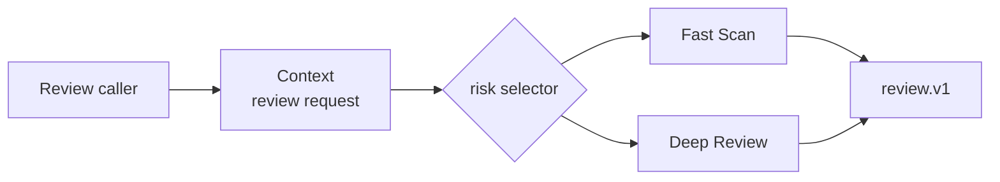

# 策略模式 / Strategy

> **Scenario / 场景:** Risk-Aware Code Review / 风险感知代码审查

## 1. 先看问题 / The problem

Small changes need a fast review; security-sensitive or large changes need a
deep review. If the root Skill owns every procedure, routing logic and review
logic become tangled:

```text
review Skill -> if risky: deep rules
             -> else: fast rules
```

## 2. 模式一句话 / Pattern in one sentence

**Select one interchangeable procedure behind a stable request/result contract.**



The Context chooses; each Strategy performs the review through the same
contract.

## 3. 现实中的 Skill / Existing Skill case

**Case Skill:** [UI/UX Pro Max Skill](https://github.com/nextlevelbuilder/ui-ux-pro-max-skill/blob/8a81ed60272d21d4b8808f7308d49a0b1b000555/.claude/skills/ui-ux-pro-max/SKILL.md) and its [router](https://github.com/nextlevelbuilder/ui-ux-pro-max-skill/blob/8a81ed60272d21d4b8808f7308d49a0b1b000555/scripts/search.py). **Status: candidate correspondence.**

What the case does: a request is routed to a procedure based on domain,
technology, or design-system context.

```text
request -> router -> selected procedure
```

The public files show routing. A complete substitutable Strategy result
contract remains unverified.

## 4. 本仓库的 Mock Skill / Mock Skill

Our concrete example is `risk-aware-code-review`:

```text
patterns/strategy/sample/
├── SKILL.md                                  # Context and selector
├── child-skills/
│   ├── fast-scan/SKILL.md                    # Strategy A
│   └── deep-review/SKILL.md                  # Strategy B
├── references/review-strategy-contract.md
├── scripts/run_demo.py
└── tests/test_demo.py
```

The important part of [`sample/SKILL.md`](sample/SKILL.md) is:

```markdown
<!-- Strategy: selector chooses a procedure; both return review.v1. -->
if `security_sensitive` or changed files >= 4:
    select `deep-review`
else:
    select `fast-scan`
Validate the same `review.v1` result after either Skill.
```

## 5. 角色对应 / Role mapping

| GoF role | Skillware carrier in this example |
| --- | --- |
| Context | root code-review Skill |
| Strategy | shared `review.v1` procedure contract |
| ConcreteStrategy | `fast-scan` and `deep-review` Skills |

## 6. 什么时候使用 / When to use

| Use Strategy when | Keep it simple when |
| --- | --- |
| several procedures are valid replacements for one request | there is one procedure with no variation |
| selection rules should stay separate from execution rules | branching changes the result contract |
| procedures can share a stable input/output contract | the alternatives share no meaningful interface |

## 7. 运行与验证 / Run and inspect

```bash
python3 sample/scripts/run_demo.py
python3 -m unittest discover -s sample/tests -v
```

Read the [complete sample](sample/), [participant map](participant-map.yaml),
[definition](definition.md), and [misuse case](misuse/explanation.md).

## 8. 证据边界 / Evidence boundary

The local sample verifies deterministic selection and a shared result contract.
The UI/UX Pro Max case is candidate correspondence and does not establish that
its alternatives are fully substitutable.
