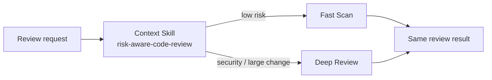

# Strategy / 策略模式

## 先看实际 Skill / Start here

**Case Skill（规范化片段）：**

```text
# upstream UI/UX Pro Max behavior sketch
request(domain, stack, style) -> search/router -> selected procedure
```

**Mock Skill（本仓库）：**

```markdown
<!-- sample/SKILL.md: one selector, two interchangeable procedures. -->
security_sensitive or files >= 4 -> deep-review
otherwise                      -> fast-scan
both return the same review contract
```

```text
sample/
├── SKILL.md
├── child-skills/{fast-scan,deep-review}/SKILL.md
├── references/review-strategy-contract.md
└── tests/test_demo.py
```

## 一眼看懂 / At a glance

**一句话：** 先根据请求选择一种算法，再用统一接口返回结果。



| | Case Skill（上游案例） | Mock sample（本仓库构造） |
| --- | --- | --- |
| **是哪一个** | [UI/UX Pro Max Skill](https://github.com/nextlevelbuilder/ui-ux-pro-max-skill/blob/8a81ed60272d21d4b8808f7308d49a0b1b000555/.claude/skills/ui-ux-pro-max/SKILL.md) + [router](https://github.com/nextlevelbuilder/ui-ux-pro-max-skill/blob/8a81ed60272d21d4b8808f7308d49a0b1b000555/scripts/search.py) | [`risk-aware-code-review`](sample/SKILL.md) |
| **哪里体现模式** | 根据 domain/stack/design system 选择不同 procedure（候选对应） | Context 选择 Fast Scan 或 Deep Review，二者共用同一结果契约 |
| **怎么运行** | 由 Skill router 选择 procedure | `python3 sample/scripts/run_demo.py` |

**看哪三个文件：** `sample/SKILL.md`、`sample/child-skills/`、`sample/references/review-strategy-contract.md`。

## 直接看实现 / Direct evidence

### Case Skill：上游实现的关键行为

下面是根据固定版本 UI/UX Pro Max Skill、`search.py` 和 design-system procedure 整理的**规范化行为片段**，不是上游原文复制：

```text
# normalized Case Skill behavior
request(domain, stack, style)
  -> search.py selects the matching procedure
  -> core.py / design_system.py produce the selected result
```

模式信号：一个路由 Skill 根据请求选择不同 procedure。本案例没有证明所有 procedure 共享完全相同的替换契约，因此保持 candidate correspondence。

### Mock sample：本仓库实际 Skill

```text
patterns/strategy/sample/
├── SKILL.md                         # Context + selection policy
├── child-skills/
│   ├── fast-scan/SKILL.md            # ConcreteStrategy 1
│   └── deep-review/SKILL.md          # ConcreteStrategy 2
├── references/review-strategy-contract.md
└── scripts/run_demo.py               # selection + injection oracle
```

```markdown
<!-- Strategy: select one procedure; every procedure keeps the same contract. -->
## Agent mode

1. Validate the review request.
2. Select Deep Review for security-sensitive or large changes.
3. Otherwise select Fast Scan.
4. Invoke exactly one child Skill through the shared `review` operation.
5. Validate the shared result contract before returning.
```

这段 mock Skill 直接对应 Strategy 的核心：选择逻辑可变，调用接口和结果契约稳定。

This record transfers the canonical Gang of Four Strategy pattern to Skillware
through Risk-Aware Code Review / 风险感知代码审查. The root review Skill is the
Context, `risk-aware-code-review-v1` is the Strategy contract, and Fast Scan and
Deep Review child Skills are ConcreteStrategies.

The Context selects Deep Review for security-sensitive requests or at least
four files and Fast Scan otherwise. Both procedures accept the same request and
return the same result fields, can be injected or directly addressed, and are
validated at the delegation boundary.

The demo module separately preserves the compact plan-level
`review({"files": int, "security_sensitive": bool})` API, whose Deep Review
threshold is strictly greater than five files and whose exact result fields are
`strategy`, `findings`, and `confidence`. It is not interchangeable with the
richer file-content CLI contract. Its Context delegates exactly once to the
selected compact `fast_scan` or `deep_review` callable.

- [English definition](definition.md)
- [中文定义](definition.zh-CN.md)
- [Participant map](participant-map.yaml)
- [Correspondence assessment](correspondence.md)
- [Runnable sample](sample/)
- [Misuse discriminator](misuse/explanation.md)

## Case Skill: upstream implementation

**Case Skill:** `ui-ux-pro-max` at
`.claude/skills/ui-ux-pro-max/SKILL.md`.

The high-star comparison is [nextlevelbuilder/ui-ux-pro-max-skill](https://github.com/nextlevelbuilder/ui-ux-pro-max-skill):
`.claude/skills/ui-ux-pro-max/SKILL.md` routes requests through
`scripts/search.py`, `scripts/core.py`, and `scripts/design_system.py` for
domain, stack, and design-system procedures. It remains candidate-only because
the cited paths do not prove one common substitution contract; see the [pinned
evidence record](../../docs/upstream-skill-evidence.md#strategy--策略模式).
The local demo makes Fast Scan and Deep Review interchangeable under one schema.

## Mock sample Skill: this repository

**Mock Skill:** [`sample/SKILL.md`](sample/SKILL.md), named
`risk-aware-code-review`. Its Context chooses either the `fast-scan` or
`deep-review` child Skill while preserving one request/result contract.

The Strategy idea is implemented by one selection policy plus interchangeable
procedures, not unrelated branches with different outputs. Run
`python3 sample/scripts/run_demo.py`; the mapping is in
[`participant-map.yaml`](participant-map.yaml).

The local sample is **constructive** evidence. UI/UX Pro Max is a **candidate
correspondence** at one fixed public revision: its tool routes among distinct
procedures, but the inspected paths do not establish one common interface or
substitution relation. Neither claim establishes ecosystem frequency,
production security quality, cross-Host equivalence, or comparative benefit.
