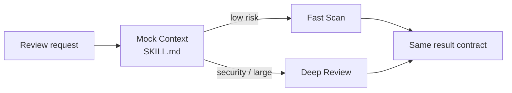

# Risk-Aware Code Review

> **This directory is the mock sample.** It demonstrates the Strategy idea
> with two interchangeable review procedures; it is not UI/UX Pro Max.

## Evidence at a glance



| Evidence layer | Open this | What proves the Strategy relation |
| --- | --- | --- |
| **Upstream case** | [UI/UX Pro Max Skill](https://github.com/nextlevelbuilder/ui-ux-pro-max-skill/blob/8a81ed60272d21d4b8808f7308d49a0b1b000555/.claude/skills/ui-ux-pro-max/SKILL.md) + [router](https://github.com/nextlevelbuilder/ui-ux-pro-max-skill/blob/8a81ed60272d21d4b8808f7308d49a0b1b000555/scripts/search.py) | One router selects among domain/stack procedures (candidate correspondence). |
| **Mock Context** | [`SKILL.md#agent-mode`](SKILL.md#agent-mode) | The root selects exactly one child procedure and validates its shared result. |
| **ConcreteStrategies** | [`child-skills/`](child-skills/) · [`references/review-strategy-contract.md`](references/review-strategy-contract.md) | Fast Scan and Deep Review are substitutable under one contract. |
| **Executable proof** | [`scripts/run_demo.py`](scripts/run_demo.py) · [`tests/test_demo.py`](tests/test_demo.py) | Tests prove the unselected strategy is not called. |

**The pattern-bearing line is:** one request → one policy selection → one of
two interchangeable procedures → the same result shape.

## Mock Skill source

```text
sample/
├── SKILL.md
├── child-skills/{fast-scan,deep-review}/SKILL.md
├── references/review-strategy-contract.md
├── scripts/run_demo.py
└── tests/test_demo.py
```

```markdown
<!-- Strategy: selection changes; the public contract does not. -->
if security_sensitive or files >= 4:
    invoke deep-review
else:
    invoke fast-scan
validate the same review result after either procedure
```

## Learn the pattern

### Before: one Skill owns every algorithm branch

```text
if security_sensitive: run_deep_rules()
else: run_fast_rules()
```

The selection policy, review procedure, and result formatting become one
large branch that is difficult to replace or test independently.

### After: select one interchangeable Strategy Skill

```text
request -> selection policy -> fast-scan OR deep-review -> same result
```

### Use it when

| Use Strategy when | Keep it simple when |
| --- | --- |
| the procedure should vary at runtime | there is only one procedure |
| alternatives share a meaningful request/result contract | alternatives return incompatible results |
| alternatives need independent tests or injection | the branch is one short local condition |

### Skill-author recipe

1. Define the shared Strategy contract first.
2. Keep selection policy in the Context Skill.
3. Invoke exactly one selected child Skill.
4. Validate the shared result after delegation.

## Scenario

A changed-file review should be fast for ordinary low-risk work and deeper for
security-sensitive or larger changes. Callers still need one review request and
one result shape.

## Why this is Strategy

The Context selects exactly one procedure, Fast Scan or Deep Review, using a
policy. Both ConcreteStrategy Skills accept the same rich contract and return
the same result contract; the procedure can change without changing the
caller-facing Skill.

| GoF role | Skillware carrier in this example |
| --- | --- |
| Context | `risk-aware-code-review` root Skill |
| Strategy | `risk-aware-code-review-v1` in `references/review-strategy-contract.md` |
| ConcreteStrategy | `fast-scan` and `deep-review` child Skills |

## Contract

Input: review id, changed files, and `security_sensitive`. Output: schema,
selected strategy, reviewed files, findings, and summary. Selection is Deep
Review for security-sensitive or four-plus-file requests, otherwise Fast Scan.

## Where to look

- [Root Skill](SKILL.md) defines selection and shared validation.
- [Strategy contract](references/review-strategy-contract.md) defines substitutability.
- `scripts/run_demo.py` supports injected strategies and direct strategy addressing.

Run:

```bash
python3 scripts/run_demo.py
python3 scripts/run_demo.py fixtures/valid/security-sensitive-review.json
python3 scripts/run_demo.py fixtures/valid/low-risk-review.json --strategy deep-review
python3 -m unittest discover tests -v
```

The demo uses only the Python standard library and performs no network or model
calls. Both strategies can be injected or addressed directly, and every result
is checked against the same exact rich contract. Mapping key order is irrelevant;
output fields and findings are canonicalized. Fixtures pin successful output
and stable failures for malformed or duplicate-member JSON, schema, types,
bounds, unsafe paths, lone surrogates, and unknown strategy identifiers.

The module-level `review({"files": int, "security_sensitive": bool})` preserves
the compact plan API separately. It chooses Deep Review for security sensitivity
or `files > 5` and returns exactly `strategy`, `findings`, and `confidence`.
It delegates to exactly one compact `fast_scan` or `deep_review` callable, both
of which can be replaced by spies without calling the unselected alternative.
Injected rich strategies may use custom procedures; the Context enforces the
shared structure, deterministic finding order, and unique identities rather
than the built-in lexical rule sets.

Python is a deterministic oracle for the participant collaboration. It does
not activate or interpret the natural-language Skills, and its small lexical
rule set is not a production security review system.
