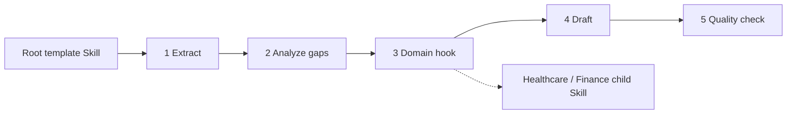

# Template Method

## 先看实际 Skill / Start here

**Case Skill（规范化片段）：**

```text
# upstream Superpowers behavior sketch
fixed ordered workflow -> task-specific content at bounded steps
```

**Mock Skill（本仓库）：**

```markdown
<!-- sample/SKILL.md: only apply-domain-hook is specialized. -->
extract -> gaps -> apply-domain-hook -> draft -> quality-check
```

```text
sample/
├── SKILL.md
├── child-skills/{healthcare,finance}/SKILL.md
├── references/rfp-domain-hook-contract.md
└── tests/test_demo.py
```

## 一眼看懂 / At a glance

**一句话：** 根 Skill 固定流程顺序，子 Skill 只能实现指定步骤。



| | Case Skill（上游案例） | Mock sample（本仓库构造） |
| --- | --- | --- |
| **是哪一个** | [Superpowers brainstorming](https://github.com/obra/superpowers/blob/896224c4b1879920ab573417e68fd51d2ccc9072/skills/brainstorming/SKILL.md) + [TDD](https://github.com/obra/superpowers/blob/896224c4b1879920ab573417e68fd51d2ccc9072/skills/test-driven-development/SKILL.md) | [`enterprise-rfp-response`](sample/SKILL.md) |
| **哪里体现模式** | Skills 固定有序工作流，内容随任务变化（候选对应） | 五个阶段顺序固定，只有 `apply-domain-hook` 可替换 |
| **怎么运行** | 由 Superpowers workflow Skill 驱动 | `python3 sample/scripts/run_demo.py` |

**看哪三个文件：** `sample/SKILL.md`、`sample/child-skills/`、`sample/references/rfp-domain-hook-contract.md`。

## 直接看实现 / Direct evidence

### Case Skill：上游实现的关键行为

下面是根据固定版本 Superpowers brainstorming/TDD Skills 整理的**规范化行为片段**，不是上游原文复制：

```text
# normalized Case Skill behavior
fixed workflow order
  -> task-specific content enters bounded steps
  -> later steps consume the ordered result
```

模式信号：流程骨架固定，任务内容在指定步骤变化。本案例没有充分证明 ConcreteClass hook 契约，因此保持 candidate correspondence。

### Mock sample：本仓库实际 Skill

```text
patterns/template-method/sample/
├── SKILL.md                         # AbstractClass + invariant skeleton
├── child-skills/
│   ├── healthcare/SKILL.md           # ConcreteClass
│   └── finance/SKILL.md              # ConcreteClass
├── references/rfp-domain-hook-contract.md
└── scripts/run_demo.py               # hook + ordering oracle
```

```markdown
<!-- Template Method: child Skills cannot reorder the root workflow. -->
1. extract-requirements
2. analyze-gaps
3. apply-domain-hook       <!-- only variation point -->
4. draft-response
5. quality-check
```

这段 mock Skill 直接对应 Template Method 的核心：根 Skill 固定算法，子 Skill 只实现一个钩子。

Template Method fixes an algorithm skeleton in an AbstractClass while allowing
a ConcreteClass to redefine selected operations without changing the sequence.

This record constructs an Enterprise RFP Response workflow. The root owns
requirement extraction, gap analysis, one bounded domain hook, drafting, and
quality checking in exact order. Healthcare and Finance specialize only the
hook through one contract.

- [Definition](definition.md)
- [中文定义](definition.zh-CN.md)
- [Participant map](participant-map.yaml)
- [Correspondence](correspondence.md)
- [Constructive sample](sample/)
- [Misuse](misuse/explanation.md)

## Case Skill: upstream implementation

**Case Skills:** Superpowers' `skills/brainstorming/SKILL.md` and
`skills/test-driven-development/SKILL.md`.

The high-star comparison is [obra/superpowers](https://github.com/obra/superpowers):
`skills/brainstorming/SKILL.md` and
`skills/test-driven-development/SKILL.md` prescribe invariant ordered
workflows with bounded task-specific content. This is candidate correspondence
because a formal ConcreteClass hook contract is not visible in those files; see
the [pinned evidence record](../../docs/upstream-skill-evidence.md#template-method--模板方法).
The local demo exposes the hook as a complete healthcare or finance child Skill.

## Mock sample Skill: this repository

**Mock Skill:** [`sample/SKILL.md`](sample/SKILL.md), named
`enterprise-rfp-response`. It fixes five stages and allows only the
`healthcare` or `finance` child Skill to implement `apply-domain-hook`.

The Template Method idea is implemented by keeping stage order in the root
Skill while varying one bounded hook. Run
`python3 sample/scripts/run_demo.py`; the mapping is in
[`participant-map.yaml`](participant-map.yaml).

The sample is constructive evidence, not proof of production RFP quality,
ecosystem prevalence, or Agent Runtime interpretation.
