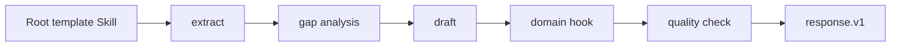

# 模板方法模式 / Template Method

> **Scenario / 场景:** Enterprise RFP Response / 企业 RFP 响应

## 1. 先看问题 / The problem

Every enterprise RFP response needs extraction, gap analysis, drafting, review,
and approval in that order. Sector-specific expertise changes the content, not
the mandatory sequence. Duplicated workflows drift in ordering and quality
gates.

## 2. 模式一句话 / Pattern in one sentence

**A root Skill fixes the workflow skeleton and delegates bounded steps to a
specialized hook Skill.**



The root owns order; the ConcreteClass supplies only the declared hook.

## 3. 现实中的 Skill / Existing Skill case

**Case Skill:** [Superpowers brainstorming](https://github.com/obra/superpowers/blob/896224c4b1879920ab573417e68fd51d2ccc9072/skills/brainstorming/SKILL.md) and [test-driven-development](https://github.com/obra/superpowers/blob/896224c4b1879920ab573417e68fd51d2ccc9072/skills/test-driven-development/SKILL.md). **Status: candidate correspondence.**

What the case does: both Skills prescribe ordered work with bounded points at
which task-specific content enters the process.

```text
fixed workflow guidance -> task-specific content -> fixed verification steps
```

The source shows workflow skeletons. A complete AbstractClass/ConcreteClass hook
contract remains unverified.

## 4. 本仓库的 Mock Skill / Mock Skill

Our concrete example is `enterprise-rfp-response`:

```text
patterns/template-method/sample/
├── SKILL.md                                  # AbstractClass template
├── child-skills/
│   ├── healthcare-hook/SKILL.md               # ConcreteClass A
│   └── finance-hook/SKILL.md                  # ConcreteClass B
├── references/rfp-domain-hook-contract.md
├── scripts/run_demo.py
└── tests/test_demo.py
```

The important part of [`sample/SKILL.md`](sample/SKILL.md) is:

```markdown
<!-- Template Method: only apply-domain-hook is specialized. -->
1. extract requirements
2. identify gaps
3. draft the response
4. apply one validated sector hook
5. run the quality check
```

## 5. 角色对应 / Role mapping

| GoF role | Skillware carrier in this example |
| --- | --- |
| AbstractClass | root RFP response Skill |
| Template Method | the five-step ordered workflow |
| ConcreteClass | healthcare or finance hook Skill |
| Primitive operation | `apply-domain-hook` |

## 6. 什么时候使用 / When to use

| Use Template Method when | Keep it simple when |
| --- | --- |
| order and quality gates must stay fixed | the full workflow varies together |
| only a few bounded steps vary by domain | there are many unrelated branches |
| the hook contract can be tested independently | no specialization point is needed |

## 7. 运行与验证 / Run and inspect

```bash
python3 sample/scripts/run_demo.py
python3 -m unittest discover -s sample/tests -v
```

Read the [complete sample](sample/), [participant map](participant-map.yaml),
[definition](definition.md), and [misuse case](misuse/explanation.md).

## 8. 证据边界 / Evidence boundary

The local sample verifies fixed order and hook limits. The Superpowers paths are
candidate correspondence and do not establish a complete Template Method role
mapping or domain quality outcome.
