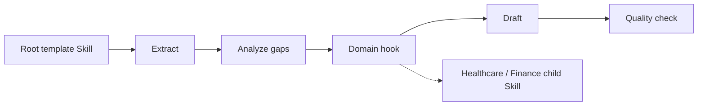

# Enterprise RFP Response

> **This directory is the mock sample.** It demonstrates the Template Method
> idea with an RFP workflow; it is not the Superpowers implementation.

## Evidence at a glance



| Evidence layer | Open this | What proves the Template Method relation |
| --- | --- | --- |
| **Upstream case** | [Superpowers brainstorming](https://github.com/obra/superpowers/blob/896224c4b1879920ab573417e68fd51d2ccc9072/skills/brainstorming/SKILL.md) + [TDD](https://github.com/obra/superpowers/blob/896224c4b1879920ab573417e68fd51d2ccc9072/skills/test-driven-development/SKILL.md) | Ordered workflow guidance with task-specific content (candidate correspondence). |
| **Mock AbstractClass** | [`SKILL.md#agent-mode`](SKILL.md#agent-mode) | The root owns the five-stage sequence and calls one bounded hook. |
| **ConcreteClasses** | [`child-skills/`](child-skills/) · [`references/rfp-domain-hook-contract.md`](references/rfp-domain-hook-contract.md) | Healthcare and Finance vary only `apply-domain-hook`. |
| **Executable proof** | [`scripts/run_demo.py`](scripts/run_demo.py) · [`tests/test_demo.py`](tests/test_demo.py) | Tests prove fixed order, one hook call, and failure stop. |

**The pattern-bearing line is:** fixed root sequence → one overridable hook →
fixed remaining sequence.

## Mock Skill source

```text
sample/
├── SKILL.md
├── child-skills/{healthcare,finance}/SKILL.md
├── references/rfp-domain-hook-contract.md
├── scripts/run_demo.py
└── tests/test_demo.py
```

```markdown
<!-- Template Method: only the domain hook is supplied by a child Skill. -->
extract -> analyze-gaps -> apply-domain-hook -> draft -> quality-check
                         ^
                         └── healthcare or finance child Skill
```

## Learn the pattern

### Before: each domain Skill copies the whole workflow

```text
healthcare Skill: extract -> gaps -> hook -> draft -> quality
finance Skill:    extract -> gaps -> hook -> draft -> quality
```

The copies drift, and a domain specialization can accidentally reorder a
mandatory step.

### After: root fixes the skeleton and exposes one hook

```text
root: extract -> gaps -> [domain hook] -> draft -> quality
                         ^ healthcare / finance Skill
```

### Use it when

| Use Template Method when | Keep it simple when |
| --- | --- |
| stage order is invariant across variants | variants change the whole algorithm |
| only bounded operations vary | every stage is optional or reorderable |
| the root must enforce quality gates | a shared sequence adds no value |

### Skill-author recipe

1. Write the invariant sequence in the root Skill.
2. Define each hook's exact input and output.
3. Let child Skills provide hook content only.
4. Test that children cannot skip, add, or reorder root stages.

## Scenario

Every enterprise RFP response must extract requirements, analyze gaps, apply a
domain hook, draft the response, and quality-check it in that order. Healthcare
and finance need different domain evidence without changing the mandatory
workflow.

## Why this is Template Method

The root Skill owns the invariant five-stage template. Healthcare and Finance
child Skills implement only the bounded `apply-domain-hook` operation; they
cannot reorder, skip, or replace the template.

| GoF role | Skillware carrier in this example |
| --- | --- |
| AbstractClass | Root `sample/SKILL.md` and `RfpResponseTemplate` oracle |
| ConcreteClass | `healthcare` and `finance` child Skills |
| Template Method | `run-rfp` / `run_rfp` fixed stage sequence |
| Primitive operation | `apply-domain-hook` |

## Contract

Input: RFP identity, domain, requirements, and source material. Output: the
same ordered stage trace, domain hook result, draft, and quality result.
Hook failure stops the template before drafting and quality checking.

## Where to look

- [Root Skill](SKILL.md) defines the invariant sequence and hook boundary.
- [Hook contract](references/rfp-domain-hook-contract.md) defines the only specialization point.
- `scripts/run_demo.py` and the healthcare/finance fixtures show substitution without reordering.

Run from this directory with Python 3.10 or newer:

```bash
python3 scripts/run_demo.py
python3 scripts/run_demo.py fixtures/valid/finance-rfp.json
python3 -m unittest discover tests -v
```

The default result is byte-for-byte equal to
`expected/healthcare-rfp-result.json`. Invalid fixtures produce the matching
stable error files with exit status 2. The demo uses only the Python standard
library and performs no network or cross-pattern imports.

The tests prove the literal `run_rfp("healthcare")` API, fixed order, exactly
one hook invocation, failure stop, shared hook contract, bounded substitution,
explicit AbstractClass dispatch, inherited mixin `run` irrelevance, direct
override admission, static hook signature validation, ordinary hook-argument
copy mutation, unknown stage-claim rejection, deterministic outputs,
duplicate-member rejection,
Unicode handling, and depth/type bounds. Focused tests and the oracle use only
the Python standard library.

Hooks are cooperative, trusted extension code. The sample does not claim
sandboxing or protection from closures, module globals, monkeypatching,
introspection, or other arbitrary in-process Python behavior.

Domain findings are illustrative, not professional RFP or compliance advice.
